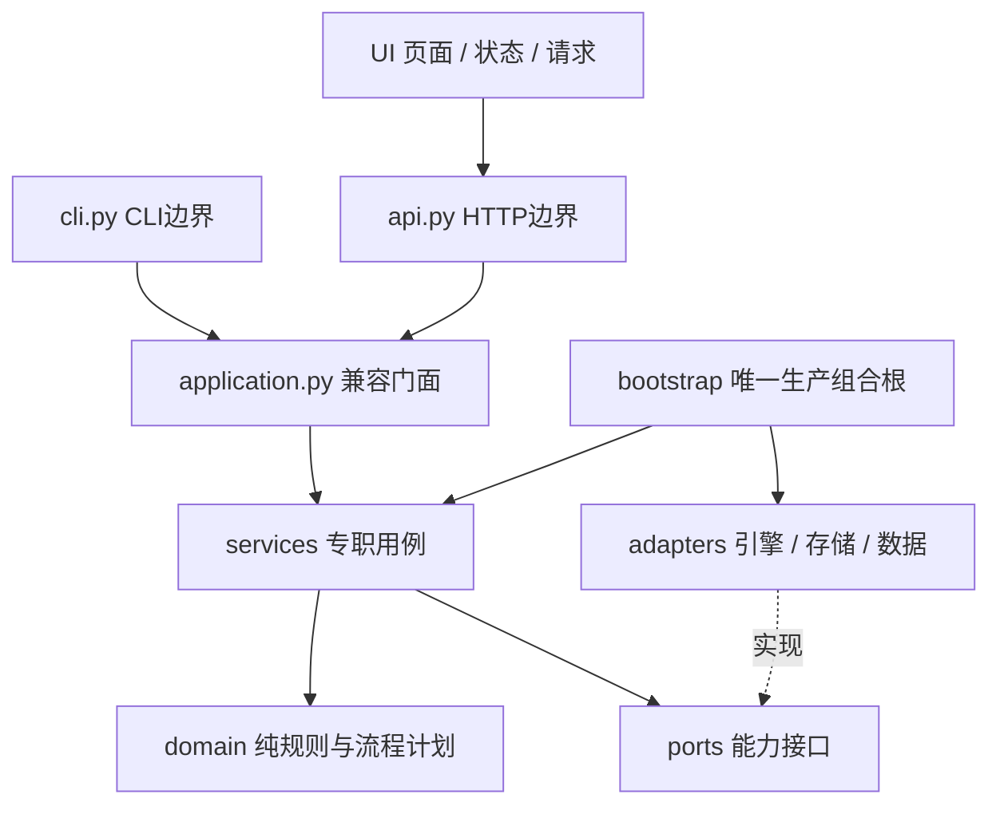
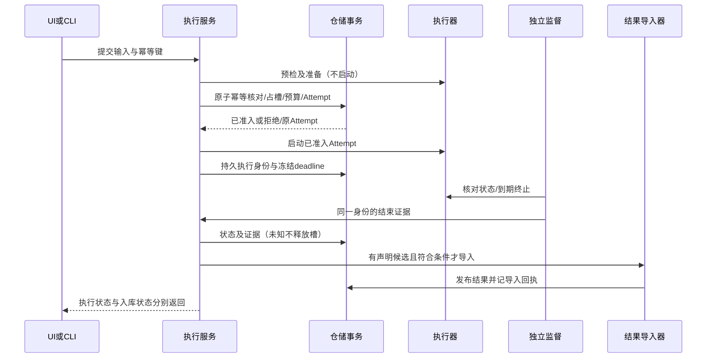

# 代码架构与实现交接合同

状态：生效架构合同，版本1，2026-09-28。来源：用户U28明确要求先落实目录、模块、接口、交互、流程、时序及角色边界，供后续实现填充。关联ARC01—12、U03/U23/U26/U27、A40。基线66d4cc77；本批实施状态与证据见IMPLEMENTATION。本文只决定结构与职责，不替代EXECUTION、VALIDATION、FACTOR_ANALYSIS、RESULT_CONTRACT的数据语义。

## 1. 架构选择与依赖

单人本地模块化单体，外部引擎独立进程。不引入微服务、消息队列、通用插件/DAG框架。框架要服务实际用例；禁止为未来能力返回虚构成功或用空实现冒充接入。



箭头为允许的调用/依赖方向；domain与ports不得反向导入service/门面/入口/适配器。服务仅依赖端口、领域规则与登记的遗留计算模块；不导入具体数据库、引擎或HTTP。组合根负责选择实现；UI不能调用存储或判断引擎内部语义。旧导入路径仅为兼容转发，新增业务禁止放入兼容模块。

## 2. 目录和职责（目标与本批范围）

| 路径 | 唯一责任 | 不应承担 |
| --- | --- | --- |
| domain/ | 纯值对象、错误、生命周期规则、固定流程计划 | 文件/数据库/网络/进程访问；读取环境配置 |
| ports/ | 仓储、执行器、数据目录、观察、运行配置等结构化协议 | 具体实现、隐藏默认配置、返回伪成功 |
| services/results.py | 导入与读取结果revision、来源投影、序列分页 | SQL、引擎产物解析 |
| services/comparison.py | 同一请求解析版本、调用比较判定、组织表格 | 前端排名、按引擎猜测口径 |
| services/factors.py | 面板登记/读取、因子分析编排 | 私自实现另一套NW/标签统计 |
| services/risk.py / validation.py | 风险与事后验证用例，调用已版本化算法 | 训练引擎执行或把事后卡当训练证据 |
| services/catalog.py | 数据目录浏览 | 通过摘要证明组件不可变 |
| services/attention.py | 按已记录状态生成待处理项 | 推断未知任务状态 |
| services/execution.py | 执行准入/核对/取消/结果入库编排 | 直接SQL、shell命令、容器SDK |
| application.py | 保留WorkbenchService入口，显式委托专职服务 | 新增算法、大段用例编排、隐式动态方法转发 |
| bootstrap.py | 从显式设置/既有环境入口构建适配器和服务 | 业务规则、导入时启动引擎 |
| adapters/storage/ | SQLite连接/schema、结果/执行/因子仓储、本地对象存储 | 在领域层传播sqlite对象或表结构 |
| adapters/executors.py | 外部进程/容器启动、终止与证据采集 | 宣布研究有效或选择策略 |
| adapters/local_data_directory.py | 已登记目录浏览 | 直接假报ARC11完整分析解析通过 |
| adapters/legacy_analysis.py | 隔离当前profile/快照路径和分析默认参数读取 | 用当前路径伪造历史身份；SR05仍须独立修复 |
| api.py / cli.py | 参数解析、传输错误映射、调用相同服务 | 复制分析公式、直接访问SQLite或组装执行器 |
| ui/state.js / transport.js | 页面选择状态与请求边界 | 量化计算、能力推断 |
| ui/app.js | 当前页面与交互编排（迁移中） | 继续扩大跨页基础设施；后续新专业页须拆为模块 |
| tests/ | 行为回归、端口契约、依赖方向检查 | 仅以存在空目录/Protocol判完成 |

遗留数值模块risk/v2、validation/v2、factors/v2、metrics等保留版本与算法，避免重构改变历史口径；其中混有文件读取的旧因子实现尚须后续分离，不能称为纯domain。research.py仍为历史快照读取/规则摘要；新研究生命周期不得继续塞入该模块。所有过渡依赖由架构门禁精确登记，允许清除，不允许静默扩大。

## 3. 模块接口与对象所有权

ports中的签名是代码接口权威，字段语义仍归专题。现有公开DTO为dict，保持兼容；新领域流程对象使用明确类型。禁止向核心传递SQLite Connection、MLflow Recorder或Qlib内部对象。

| 接口 | 调用方 / 实现方 | 语义边界 |
| --- | --- | --- |
| ResultRepository | ResultService / 本地仓储 | publish原子发布revision；查询不启动训练，结果不存在为None |
| FactorRepository | FactorService / 本地仓储 | 内容规范化后发布面板；分页/规模遵守因子合同 |
| AttemptRepository | ExecutionService / 本地仓储 | 持久执行与预算/回执；原子准入目标依EXEC13-A，不因定义Protocol即认为已实现 |
| DataDirectoryPort | CatalogService / LocalDataDirectory | available/list/summary/load/validate；浏览端口不是已校验历史分析输入端口 |
| AnalysisConfigurationPort | 风险/因子服务 / LegacyAnalysisConfiguration | 显式注入默认年化及旧快照定位；旧定位标为迁移债务 |
| ResearchObservationPort | 门面 / ResearchSnapshots | 读取离线研究记录，不执行模型或伪造实时会话 |
| ExecutorPort / AttemptImporter | ExecutionService / 引擎与导入适配器 | prepare不启动；start启动一个Attempt；poll/cancel返回证据；导入失败不反写引擎成功状态 |

端口按服务拆分；兼容WorkbenchRepository可组合三个仓储协议，但专职服务只获取所需能力。异常归domain/errors，存储与服务依赖同一异常类型；旧错误导入保持兼容。应用错误到HTTP/CLI的转换在入口完成；错误码含义不由适配器重新发明。

工厂返回完整服务对象图，不在每次请求重新创建数据库/执行器。测试可直接注入内存/临时目录实现；创建服务不得启动引擎、导入示例或下载数据。服务对象构造时不声明未实现研究能力可用。

## 4. 主流程、角色与时序

### 4.1 当前结果查询与比较

UI/CLI输入run及可选revision → 用例解析一次确切revision → ResultRepository读取 → 来源/口径规则 → 服务生成DTO → API/CLI序列化 → UI展示。比较在同一请求内复用已解析结果，不能一列一个时点读取latest；统计不可用保持原因。读取目录摘要与真正分析输入校验是不同操作。

### 4.2 执行与发布（行为目标；SR01—03未完成）



事务不能跨引擎/网络执行；启动与持久化之间的崩溃通过预分配Attempt身份/工作目录恢复，不声称两个系统原子提交。取消请求先持久化再执行，无法确认结束保留占槽。独立监督不是GET副作用的别名。真实实现及具体恢复字段依EXEC13-A单独验收，本结构批次不关闭SR。

### 4.3 后续训练/挖掘/回测固定计划

domain/workflows定义三种固定计划及步骤依赖，用于约束职责与交接，**不是运行器**。不提供单步重试/任意DAG编辑器：Attempt仍代表整份固定工作流。

- train：准备冻结输入 → 折内训练 → 预测 → 样本外评价；训练适配器产生模型和预处理状态，服务登记产物版本；验证必须实际执行，不能以现有事后卡顶替。
- mine：准备冻结输入 → 生成候选因子 → 因子评价；生成器只产出候选，统一统计服务评价，TrialLedger保留失败/淘汰/选中。
- backtest：准备冻结输入 → 读取已有信号或用已有模型预测 → 构建组合 → 模拟成交 → 评价；本路线无训练步骤，修改成本不重训。信号可用时点/成交时点依CN与数据合同。

后续研究编排服务拥有Run/Stage关联，执行服务拥有Attempt与资源政策，领域规则拥有版本/复用判定，适配器拥有引擎细节，仓储拥有事务和不可变发布。UI不决定状态晋级。未登记模型/预测输入契约、缺真实训练证据或缺数据组件就拒绝对应步骤，不填空产物继续。

T06/T07仍需冻结物理schema、研究命令DTO、产物载荷与运行适配契约；不得依据计划对象直接对外声称可训练。计划与接口不预先强制使用某个训练库或新基础设施。

## 5. 前端边界与兼容

state模块只创建/保存客户端选择与导航上下文；transport统一请求、错误与过期渲染检测；页面调用服务DTO，不本地计算指标或放宽可比性。新页面须保持研究/revision上下文及加载/空/错误/不可用状态。现有app.js的页面抽取分批进行，尚未完全拆分；不得以新增两个文件宣布T09完成。

保持既有URL、CLI命令、HTTP路由、v1默认与v2语义、WorkbenchService公开签名和旧Python导入。本批无数据库schema变化、无历史对象迁移；移动实现只变代码归属。兼容导出不复制实现；内部代码逐步使用规范路径，不新增对旧存储入口的依赖。

## 6. 交付门禁与填充规则

1. 新用例先确定要求ID、所属服务、所需端口、入参/结果/失败语义及事务边界；不能绕过专职服务在api/cli直接实现。
2. 外部依赖只进适配器，组合根注入；领域模块保持可离线测试。已有遗留例外精确列出文件/依赖和关联缺口，新例外必须先更新本合同并说明理由。
3. 自动架构检查覆盖禁止依赖、兼容转发、不允许的新顶层模块及端口方法覆盖；加入workbench_gate，不以文档约定替代检查。静态检查不证明全部运行时路径、事务原子性或类型正确。
4. 专职服务回归证明既有HTTP/CLI输出与持久化行为保持；新增依赖检查须包含故意违法输入的反例，确保检查器真的拒绝错误方向。
5. 功能交付回写IMPLEMENTATION/专题与CHANGELOG；框架验收仅为A40结构子项，不关闭A35—A42父项。SR01—06和UI能力矛盾继续开放，不能借移动文件标为修复。

## 7. 后续实现者从哪里填充

以下是指定归属，**尚未创建/实现**；不要提前建返回成功的空类。先完成IMPLEMENTATION的SR修复，再依T06/T07设计门实施。

| 待实现内容 | 指定位置 | 开始编码前必须冻结 |
| --- | --- | --- |
| 保存定义、开始研究、重试、模型复用 | services/research_runs.py；纯判定扩展domain/research.py | 命令DTO、Run/Stage/Attempt关联、幂等范围及逐类拒绝响应 |
| 研究对象/账本仓储 | ports/research.py → adapters/storage/storage_research.py | 不可变版本、事务范围、迁移/备份恢复方案；不得直接借用结果revision当定义版本 |
| 训练、预测、挖掘、回测引擎绑定 | ports中对应能力协议 → adapters中独立实现 | 输入/输出产物schema、版本身份、可用时间、失败/取消和预算证据；禁止返回引擎内部对象 |
| 专业创建页、实验详情页 | ui中独立页面模块，经app.js注册与API调用 | 与对应命令/查询DTO一致的加载、空、错误、不可用状态；URL上下文、默认值说明与恢复路径 |

固定计划的`owner`是职责标识，并非已存在服务名或可执行注册表；不得用字符串反射启动类。`prepare`由研究服务核验冻结输入；`train/predict/generate/simulate`由相应适配器提供证据；`portfolio`归策略构建；`evaluate`依流程分别归验证/因子/绩效评价。backtest的signal步骤接收已有预测或由已登记模型推理，不包含训练。各步骤产物载荷须先通过上述详细设计门；`WorkflowPlan`只保证步骤标识唯一、依赖引用先前步骤，不能证明数据正确或工作流可运行。

每个新增用例必须同时交付一份具体成功命令/响应示例、一份失败示例、端口签名、时序/事务说明和行为测试。只新增Protocol、占位按钮、schema字段或计划对象不算能力交付。测试按职责进入现有tests/test_*.py；涉及真实引擎继续使用隔离沙箱，不能借架构测试触发用户研究或访问生产库。

### 本批过渡边界的精确说明

- `tests/architecture_rules.py::LEGACY`逐文件登记旧计算/来源/研究摘要/执行政策依赖；`TOP_LEVEL`冻结旧平铺模块。旧模块内部尚未完全按新分层拆开，检查器不证明传递依赖无IO。结果算法迁移不得改变数值版本或重新解释历史数据。
- `WorkbenchSettings`显式提供存储、数据与观察根目录；`build_service`保留环境兼容入口。执行policy与旧分析profile仍使用现有加载规则，不能称为全部配置已可独立部署。`build_workbench`是生产组装入口；`WorkbenchService`直接构造且未给analysis_configuration时通过bootstrap默认工厂兼容旧调用，这是唯一有意保留的反向工厂调用。新增专职服务不得复制这种回退。
- `services/execution.py`仍保留直接构造时加载默认policy的兼容路径，生产组合根显式传入同一policy实例；其旧监督、取消、预算行为仍受SR01—03限制。
- 前端transport的`api`统一GET的JSON错误及过期渲染检测；`request`保留原始Response供提交/取消/入库处理。写操作不重放、不自动重试，也不自动套用GET的过期检测；现有写操作错误展示由页面处理。页面尚未完全模块化，后续不得误以为所有请求已统一成同一错误模型。

2026-09-28数据处理实现归属：新增adapters/snapshot_files.py处理逐文件内容身份/已验证字节，adapters/data_preparation.py处理冻结/质量/发布与面板输出；FreeSnapshotReader消费已验证bytes；LocalDataDirectory本身仅为目录浏览；2026-09-29另以SnapshotAnalysisDirectory接入真实因子数据端口，见§8，不宣称所有分析路径已迁移。既有data_directory和factor_pipeline逐步委托，不把新IO放进services/domain。物理合同见[DATA_PROCESSING](DATA_PROCESSING.md)。

## 8. 真实快照因子UI接入（2026-09-29，用户明确授权）

用户要求恢复不可点击UI并切换到真实数据。入口故障证据：旧8765服务进程仍使用旧资源白名单，最新app.js依赖的state.js返回404；不是数据本身不可用。服务重启前确认无活动Attempt，平台库一致性备份后按现有迁移升级，禁止清空旧结果。前端增加模块加载失败可见提示/刷新，不再静默停在加载中。

本批真实接入范围为数据目录、真实日频因子面板与统一因子分析；训练/组合回测入口仍按各自已验能力标记，不把已有模拟结果改成真实。推荐快照沿用free_cn_20260924_processed_v1；不改原CN模拟情景指纹，也不让历史结果随当前默认数据变化。

新增`FactorDataPort.resolve(dataset, calendar_id)`与`FactorInputPort.calendar()/read(dates,instruments,horizons)`；实现放adapters/snapshot_analysis.py，组合根显式注入FactorService。返回标准数值网格/成员掩码/来源依据，不传Qlib/MLflow对象。真实面板使用`dataset.id=snapshot:<snapshot_id>`、version=登记content_digest、snapshot_label=<snapshot_id>，calendar_id=calendar:<calendar组件摘要>；这利用已有持久化字段，不迁移因子schema。snapshot命名空间必须经目录解析；未知/版本不符/日期身份不符/内容变动立即拒绝，不回退当前CN配置。旧无命名空间的显式模拟面板保留兼容路径。

真实分析保留完整日历轴、逐日成员掩码，标签复用DATA_PROCESSING完整窗口与单价日保守规则。服务调用既有v2统计，不另写NW。新入库三个确定性手工基线因子momentum_20、volatility_20、turnover_20，以2025-01-02至2026-09-24计算，明确先排除20日热身，再保存401日×643历史标的面板，非成员/无效状态为null。它们是“真实行情上的工作台计算”，不是手写行情样本、Agent挖掘或训练成果。幂等导入保留内容版本，读取API不触发导入。

UI优先选择真实数据组并明确来源/区间/基线性质；数据页不依赖先选运行，独立显示真实快照，旧运行的数据证据继续按该运行版本显示。默认真实因子窗口不代表已训练模型或回测收益；UI内明确指出模拟执行入口未切换。

无hash且无运行/比较/研究查询上下文时，首次进入因子页；历史深链保留。因子分组选择须暴露aria-selected；真实基线用provenance.market_data_kind识别，既有data_nature保留兼容，不把“有来源”升级为官方认证。p/q小于显示精度时使用科学计数，不能把非零概率显示为0。首批适配器只接收free_community_unverified + finv_adjusted_v1；其他源需要明确扩展合同。

### 可执行交接与失败边界

仓库根运行（数据根须指向已处理目录；不下载、不训练）：

```sh
.venv/bin/python scripts/import_real_baseline_factors.py --root .data/workbench --data-root "$HOME/.qlib/qlib_data" --snapshot-id free_cn_20260924_processed_v1 --start 2025-01-02 --end 2026-09-24
.venv/bin/qwb --root .data/workbench serve --port 8765
```

导入输出含panels[].factor_id/panel_id/content_hash/created/panel_created；重复运行须三个panel_created=false。查询`GET /v1/factors`取得真实组ID，随后`GET /v1/factor-analysis?factor_id=<ID1>&factor_id=<ID2>&factor_id=<ID3>&horizon=1&horizon=5&horizon=10&analysis_version=2`。成功响应schema_version=2，basis.sample为401×643，basis.dataset.version等于登记摘要；basis.snapshot.verification_scope=`consumed file bytes`。files=19824是登记文件总数，不表示每次分析消费了全部文件。失败例：登记版本或日历与面板不符返回409、code=`snapshot_content_mismatch`，details包含snapshot_id和component=`dataset/calendar identity`；未登记返回404、code=`snapshot_not_found`，不输出本机路径。

时序：写命令先构造已验证读取器→计算/遮罩三面板→逐面板仓储事务幂等发布（非三面板全局事务，中断后重跑补齐）；只读分析先检查面板版本一致→解析登记身份/日历→对齐完整日期轴→核验实际消费字节并计算标签→同一成员/状态掩码处理因子→v2统计→携带依据与限制返回。每次请求重新解析登记，单请求可复用已验证不可变bytes。基线定义固定：动量仅要求两端价格，波动率要求21日价格完整，换手均值要求20日值完整；三者均按因子当日历史成分与已知状态过滤，不要求预测期末仍为成分股。未知源历史可用时点仍标unknown。

## 9. 一键数据与人参与研究的扩展框架（U29/U30，设计未实现）

本节新增目标边界，不能视为已存在的文件/Protocol或已支持能力。继续模块化单体、固定流程和共用Run/Attempt，不新增独立任务引擎或通用DAG。业务唯一合同为[DATA_PIPELINE](DATA_PIPELINE.md) ING01—08及[HUMAN_RESEARCH](HUMAN_RESEARCH.md) HR01—10。

| 目标模块 | 定位、输入与输出 | 禁止跨界 |
| --- | --- | --- |
| domain/data_pipeline.py | 纯规则：计划/状态投影、CDF字段与缺失分类、合并/质量政策判定 | 不联网、不操作目录、不识别具体SDK |
| services/data_pipeline.py | 数据方案/计划用例，编排固定7步，发布回执与默认指针管理 | 不直接读供应商文件、不按UI选项绕过门禁 |
| ports/data_acquisition.py | SourceAdapter、Normalizer、Quality、Publisher的中立协议 | 不泄漏Qlib/DataFrame/供应商会话对象 |
| adapters/data_sources/<source>.py | 来源能力/限流/原料采集和源格式映射；每源独立模块 | 不负责跨源选择、计算研究指标、直接写业务状态 |
| adapters/data_normalization.py / data_quality.py | 执行版本化CDF映射/检查，生成摘要和分块产物，复用领域判定 | 不改旧快照；异常不静默删除 |
| domain/research_inputs.py / factor_expression.py | 三类输入/评议/交接规则、受限公式AST/单位/时间推导 | 不调用LLM、无动态代码执行 |
| services/research_workflows.py | 主题/定义/人工决定、固定交接链、幂等自动推进、账本 | 不包含供应商提示词、模型客户端或统计公式 |
| ports/research_agent.py / factor_compute.py | 中立Agent任务和确定性公式执行/评价接口 | 不把LLM文本当指标，不混同评议和计算 |
| adapters/research_agents/<agent>.py | TaskEnvelope到具体Agent协议转换、脱敏/输出解析与能力声明 | 不越过执行服务启动无预算进程，不改上游源码 |
| adapters/factor_expression_engine.py | 受限DSL编译/隔离计算、产物验证；引擎实现可替换 | 不准任意Python/eval和临时安装依赖 |
| services/factors.py | 复用已验统计版本并按协议组织评价、参考集和来源依据 | 不因入口为Agent就改口径或接受它自报数字 |
| adapters/storage/storage_data_pipeline.py / storage_research_workflows.py | 各自仓储端口的事务、版本/边唯一约束、回执和恢复 | 不复制另一份结果/Attempt状态机 |
| ui/pages/data_pipeline.js / research_inputs.js | 专业输入、进度、问题/结果与下一步；共用状态/transport | 不解析原料、不在浏览器计算统计或决定可信等级 |

### 9.1 目标端口与数据传递

下面是方法语义合同，DTO不得含活连接/引擎对象；大数据传不可变ArtifactRef（id/schema/digest/受控访问引用），API不返回本机绝对路径。签名与字段在实现时同步契约，不另改语义：

| 端口方法 | 返回与约束 |
| --- | --- |
| SourceAdapter.capabilities() → SourceCapabilities | 支持组件/字段/频率/范围、版本锁/分页/限流/历史时点能力；已验证状态与版本 |
| SourceAdapter.plan(SourceRequest) → SourceFetchPlan | 分块与冻结源身份、未知估计、预检；无下载 |
| SourceAdapter.fetch(plan, checkpoint_ref, execution_context) → RawBatchManifestRef | 仅外部worker执行；受取消/限流/预算控制；checkpoint必须有完整性证据 |
| Normalizer.normalize(raw_ref, mapping_revision) → NormalizedBatchManifestRef | 统一语义、缺失原因与来源引用；不跨源裁决 |
| Reconciler.merge(batch_refs, merge_policy_revision) → CandidateSnapshotRef | 分区有界处理，选定值与全部冲突/来源清单 |
| QualityEvaluator.evaluate(candidate_ref, quality_policy_revision) → QualityReportRef | 硬错误/受限用途/未知分开，报告失败可保存 |
| SnapshotPublisher.publish(candidate_ref, report_ref) → PublicationReceipt | 服务端重验门禁与传递摘要，原子不覆盖发布/幂等复用；原始URI不是许可 |
| ResearchAgent.review(TaskEnvelope, execution_context) → AgentArtifactBundle | 返回有schema版本的Review/Proposal，不直接写数据库 |
| FormulaCompiler.validate(formula_revision, field_contract, operator_revision) → CompileReport | 类型/单位/时间/预算检查、规范AST或明确diagnostics；无隐式改写 |
| FactorComputer.compute(definition_ref, snapshot_ref, protocol_ref, execution_context) → FactorPanelManifestRef | 受控worker，冻结计算身份；不把标签传成特征 |
| FactorEvaluator.evaluate(panel_refs, protocol_ref, reference_set_ref) → EvaluationReportRef | 复用统一统计，实现与声明版本一致，未知/未支持项保持不可用 |

服务通过共用ExecutionService创建/取消/监督Attempt，执行器注册固定workflow_kind；worker调用适配器并提交经验证的产物引用。bootstrap唯一组装注册表，新增来源或Agent由显式配置和能力注册完成，不通过名称反射导入任意类。上述方法不表示全部在HTTP请求线程顺序同步运行。

### 9.2 Run身份、事务与跨阶段时序

扩展LIFE01的唯一例外：Run.workflow_kind=data_prepare时definition_ref指向DataPipelineDefinitionRevision+DataPreparationPlan，experiment_id=null；研究direction_review/hypothesis_review/formula_evaluate仍指向ExperimentDefinitionRevision且属于Experiment；文字任务的data/protocol可空规则严格按RESEARCH_LIFECYCLE §6，不套用于公式数值评价/训练。Attempt依然只属于一个Run，结果记录与来源引擎状态不变。不因数据任务没有研究Experiment而创建伪模型/伪研究结果；列表按workflow_kind筛选。

研究固定计划：方向=prepare→review→publish；假设=prepare→review→propose_formula→publish；公式=prepare→review_compile→compute→evaluate→publish。不改既有train/mine/backtest计划；formula_evaluate不偷偷训练模型或回测组合。Review业务否定可成功发布；没有候选时propose_formula阶段记录skipped/业务原因，而Attempt可succeeded。数据计划见ING03。

准入事务：检查幂等及确切定义/plan→占并发槽和预留预算→创建Run/Attempt/自动边记录；提交后启动worker，失败留下启动失败证据。外部网络/模型/计算不持SQLite写锁。预算账本、TrialLedger记录与产物入库分别保留身份，不能拿运行条数冒充候选数；自动子边创建与任务准入通过持久化唯一键和事务保证至多一次准入，不承诺外部LLM调用恰好一次。超时后未确认调用结果不得隐式重放；显式重试会计费并留痕。

产物先写临时对象并验证摘要/schema，再事务登记引用及阶段事件；失败前临时产物不对外宣称可用。跨原料文件/注册表/SQLite不是一个数据库事务：用发布回执+幂等恢复协调，目录发布事实以原子登记为准，恢复不反向覆盖它。用户决策与自动边都绑定确切版本，乐观并发expected_revision防止覆盖草稿。

### 9.3 编码前物理设计门与兼容

业务语义及逻辑端口本批已冻结；数据库DDL/索引、schema3 JSON Schema、全部HTTP DTO与CLI参数映射仍须在首个实现里程碑**编码前**提交设计补充，不能凭本文概念直接拼库。必交付：按现存最高schema递增的迁移/回滚备份方案（不预占数字）、版本与边唯一约束、预算原子性、对象发布回执恢复、完整成功/错误载荷、实际源与Agent能力矩阵、政策默认限额数值及来源、隔离样例契约测试。

保留旧研究快照/因子面板/Attempt与v1/v2分析路由，不自动合并主题、不补写unknown来源、不原地升级schema2数据。首批功能开关默认关闭，只有相应验收通过后在能力目录暴露ready；关闭开关仍可读已发布历史产物。本轮只修改spec，不实施任何迁移。
