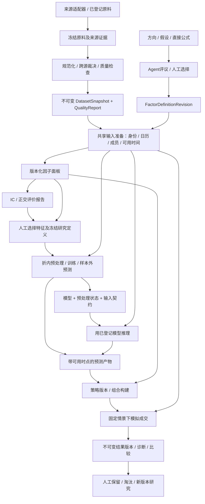
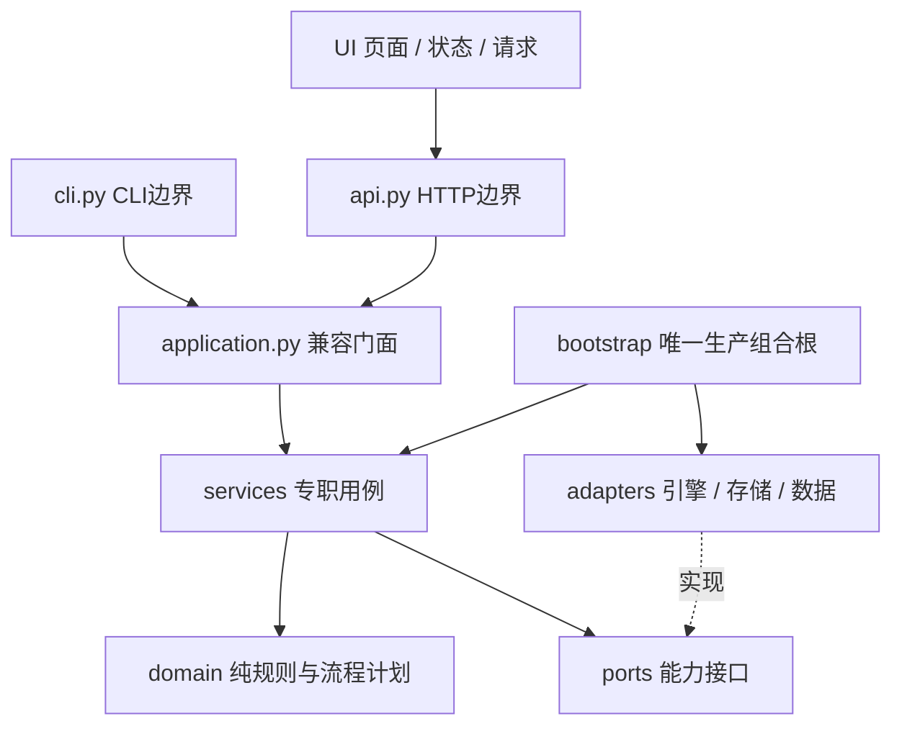
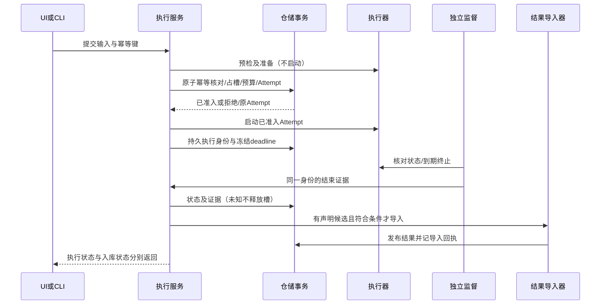

# 代码架构与实现交接合同

状态：生效架构合同，版本2，2026-09-29。U31要求全项目数据流、功能协同与可维护性统一设计；目标架构尚未整体实现；2026-09-30共享框架部分落地见§10。原U28结构落地日期为2026-09-28。来源：用户U28明确要求先落实目录、模块、接口、交互、流程、时序及角色边界，供后续实现填充。关联ARC01—13、U03/U23/U26/U27/U31、A40/A45。原U28结构批次基线66d4cc77；U31设计审查历史基线f2a8821a，本次结构复审基线4f11929a。各批实施状态与证据见IMPLEMENTATION。本文只决定结构与职责，不替代EXECUTION、VALIDATION、FACTOR_ANALYSIS、RESULT_CONTRACT的数据语义。

## 0. 全项目主合同（U31 / ARC13，目标设计）

本文是跨专题集成入口。它决定对象归属、依赖与端到端交接；数据字段/质量归DATA_PIPELINE和DATA_PROCESSING，统计归FACTOR_ANALYSIS/VALIDATION，Run生命周期归RESEARCH_LIFECYCLE，Attempt归EXECUTION，结果身份归RESULT_CONTRACT。专题不得另设同义对象或另一套状态机。当前已实现部分见§8及IMPLEMENTATION；下面的完整闭环尚未实现。

### 0.1 完整数据流与产品闭环



箭头表示版本化产物消费，不表示点击上游按钮会自动运行全部下游。直接公式没有伪造的方向/假设前序；人工可选择确定性因子策略而不训练模型。图中“面板→策略”必须经显式StrategyArtifact规则将因子值转为信号/权重，不能直接把数值当持仓。模型路线与确定性规则路线最终共用组合、执行情景和绩效口径；回测不隐式训练，改变费用只重跑回测。研究建议转成训练输入须用户明确选择，不把一次显著IC自动晋级为有效策略。实盘不在当前实施范围。

### 0.2 对象所有权：一个事实只有一个写入负责人

下表是目标职责，不代表相应文件已创建。服务通过端口写入；“拥有”不等于自己操作SQL。共享仓储事务协调跨表写入，不允许多个服务各存一份权威状态。

| 对象/事实 | 唯一用例负责人 | 下游只消费什么 |
| --- | --- | --- |
| 数据方案、冻结计划、原料/规范批次、质量报告、快照发布及默认指针 | DataPipelineService | 已发布快照/报告确切引用；默认只用于新草稿 |
| Experiment、按任务类型的定义、Run、Stage与产物关联 | ResearchRunService（services/research_runs.py；也管理无Experiment的数据Run） | run_id、冻结definition_ref、已登记阶段产物；不暴露仓储表 |
| 人工输入/选择、候选交接边、自动链策略、候选试验账本 | ResearchWorkflowService（services/research_workflows.py） | 输入/候选版本和调用RunService的命令；不另造Run/Attempt注册表 |
| Attempt、资源槽、截止时间、调用/费用预算、结束证据与入库回执 | ExecutionService | Attempt状态及证据；预算范围由冻结定义提供，计费/预留由此服务统一执行 |
| 字段/算子与时间语义、特征/标签/样本准备规则 | domain纯规则 + 输入准备端口；RunService组织调用 | 带版本和依据的准备产物；不将标签或测试集拟合状态送入特征计算 |
| 因子面板与因子评价报告 | FactorService | panel_ref/report_ref；统计版本和评价协议完整固定 |
| 模型/预处理/预测/策略产物 | RunService登记；对应训练/预测/组合适配器生产 | 经验证的中立manifest及受控载荷；不返回引擎内存对象 |
| 结果revision、导入来源绑定、比较与诊断投影 | ResultService；比较/风险/验证服务只读或显式发布派生报告 | 确切revision及依据；历史结果不被当前配置重解释 |

存储适配器负责唯一约束、原子准入与发布，bootstrap负责组装。DataPipelineService和ResearchWorkflowService均通过RunService创建Run，再由ExecutionService准入Attempt；涉及自动边、Run、Attempt、预算的写入使用同一应用事务端口协调，不能分成三个独立提交。Run可先作为未执行对象保存；开始/重试的事务须绑定已存在或本事务创建的Run。资源不足不产生半条已准入自动边。预检无外部执行，事务内重验可能竞争的条件；网络、引擎和LLM调用全部在提交后。

### 0.3 身份及贯穿全链的输入准备

- `instrument_id`是唯一内部证券身份（DATA02）；供应商symbol是带有效期映射的别名。CDF1不另设security_id。日期轴、时区、会话、成员有效区间和字段单位在数据边界统一，不由每个引擎自行猜测。
- DatasetSnapshot内容版本、引擎物化摘要、准备视图身份是三层。快照身份按所属schema规范清单计算；物化记录父快照、转换规则版本与输出摘要；准备视图另绑定日期范围、历史池、字段/公式、标签、样本政策及可用时间规则。不同引擎文件不同不等于逻辑数据不同；同快照也不等于评价样本相同。不得凭供应商版本字符串证明内容相同。旧files_sha256身份保留原解释，不原地升级成新逻辑身份。
- `ArtifactRef`统一表示artifact_id、artifact_type、schema_version、content_digest；manifest包含父引用、生产Run/Attempt（历史导入可unknown）、代码/算法版本和来源证据。路径是可迁移的受控定位，不是身份。数值版本和来源分类不得藏在UI备注里。具体DTO与序列化在§9.3设计门冻结，不能把概念字段直接当现有API。
- 目标新增`ports/data_inputs.py`的已验证分块读取/准备产物接口：输入是确切snapshot_ref及版本化准备请求，输出为中立分块/manifest引用和依据。数据适配器负责读取已核验字节；共享纯规则负责日历对齐、历史成员、标签完整窗口、样本排除和时间判定。Qlib/RD-Agent/公式引擎只能消费或等价物化这份合同，禁止各写另一套标签/成员规则。现有FactorDataPort仅为真实因子切片过渡接口，不能直接宣称通用输入准备已完成。
- 标签可用于评价与训练监督，不能进入因子特征；训练预处理器仅在每折train拟合，valid/test只transform。统计用的标签残差不得复用成特征。特征选择也属于拟合/搜索，选择所见区间必须入TrialLedger，不得先看全部数据IC选因子再把同一区间声称为未见测试。
- 每份预测记录signal_available_at；组合与成交使用各自声明的决策/可成交时点、原始成交价及公司行动处理依据。研究复权价格不能未经转换用于成交记账；缺少相应数据/规则时阻断对应真实回测能力。历史available_at未知可作明确受限探索，不能通过结构检查升级为严格PIT验证。

缓存键至少包含所有影响该产物的父引用、规则/算法版本与有效参数；同键复用须核验已发布载荷，丢失/漂移不得返回成功。上游新版本只影响新任务，旧报告不自动刷新；重新评价生成新report_ref。切换数据、特征、样本或拟合配置使模型复用判定失效时，明确拒绝，不自动重训。

### 0.4 状态、能力与低负担界面

Execution状态、产物发布状态、数据质量/适用用途、统计有效性、Agent意见、人工决定相互独立。例如Attempt succeeded + report published + hypothesis rejected是正常业务结果；数据质量通过 + available_at unknown仍不能声称严格回测有效。UI和API使用同一能力投影，依据“实现已验收、配置/引擎可用、输入组件与时间证据满足、定义完整、执行政策允许”逐项返回可执行性和阻断原因，不能用一个ready字段代表全部质量。源适配器支持字段不等于当前快照有字段，快照有字段不等于训练引擎已接入。

| 页面/动作 | 必须可见的上下文 | 完成后有意义的下一步 |
| --- | --- | --- |
| 数据准备 | 冻结范围/来源、质量问题及允许用途 | 查看报告、以确切快照创建研究草稿；设默认须显式动作 |
| 三类研究输入 | Experiment、输入版本、人工/自动范围与预算 | 澄清、选择提案、查看公式报告；否定也可保存 |
| 因子评价 | 面板/数据/标签/区间/参考集/统计版本 | 选择特征或定义规则策略；不能自动宣称有效模型 |
| 训练验证 | 已选特征、切分、拟合范围、数据限制 | 查看每折证据、使用模型推理或创建回测草稿 |
| 回测比较 | 策略/预测版本、成交情景、账户与样本 | 同口径比较、保留/淘汰、复制新版本 |

数据页不要求先选结果Run；全局默认数据、编辑中草稿、活动Run、正在查看的历史report是不同上下文。跨页传确切引用，历史页不被全局默认替换。后端返回明确下一步/不可用原因；前端不推断数值越大越好或自行放宽门禁。长计算用显式命令进入共用执行通道，GET读取已发布报告/进度；当前因子GET同步计算保留为历史接口，迁移时另设版本化报告命令，不悄悄改变旧响应或假称其已持久化。刷新/离页不取消工作，等待人工不占运行槽。

### 0.5 全局实施和验收原则

先冻结上述共享身份、对象所有权与端口载荷，再实现安全执行及版本发布，然后逐条打通数据→公式评价、训练→样本外预测、已有策略→回测这三个纵向切片。T11/T12是领域工作包，不是可另建底座的独立项目。完整顺序与A45端到端验收见IMPLEMENTATION。保持模块化单体；按职责拆分大文件，不以行数或目录数量作为架构正确证明，不为每个DTO创建一个服务。

## 1. 架构选择与依赖

单人本地模块化单体，外部引擎独立进程。不引入微服务、消息队列、通用插件/DAG框架。框架要服务实际用例；禁止为未来能力返回虚构成功或用空实现冒充接入。



箭头为允许的调用/依赖方向；domain与ports不得反向导入service/门面/入口/适配器。服务仅依赖端口、领域规则与登记的遗留计算模块；不导入具体数据库、引擎或HTTP。组合根负责选择实现；UI不能调用存储或判断引擎内部语义。旧导入路径仅为兼容转发，新增业务禁止放入兼容模块。

## 2. 目录和职责（目标与本批范围）

| 路径 | 唯一责任 | 不应承担 |
| --- | --- | --- |
| domain/ | 纯值对象、错误、生命周期规则、固定流程计划 | 文件/数据库/网络/进程访问；读取环境配置 |
| ports/ | 仓储、执行器、数据目录、观察、运行配置等结构化协议 | 具体实现、隐藏默认配置、返回伪成功 |
| services/results.py | 导入与读取结果revision、来源投影、序列分页 | SQL、引擎产物解析 |
| services/comparison.py | 同一请求解析版本、调用比较判定、组织表格 | 前端排名、按引擎猜测口径 |
| services/factors.py | 面板登记/读取、因子分析编排 | 私自实现另一套NW/标签统计 |
| services/risk.py / validation.py | 风险与事后验证用例，调用已版本化算法 | 训练引擎执行或把事后卡当训练证据 |
| services/catalog.py | 数据目录浏览 | 通过摘要证明组件不可变 |
| services/attention.py | 按已记录状态生成待处理项 | 推断未知任务状态 |
| services/execution.py | 执行准入/核对/取消/结果入库编排 | 直接SQL、shell命令、容器SDK |
| application.py | 保留WorkbenchService入口，显式委托专职服务 | 新增算法、大段用例编排、隐式动态方法转发 |
| bootstrap.py | 从显式设置/既有环境入口构建适配器和服务 | 业务规则、导入时启动引擎 |
| adapters/storage/ | SQLite连接/schema、结果/执行/因子仓储、本地对象存储 | 在领域层传播sqlite对象或表结构 |
| adapters/executors.py | 外部进程/容器启动、终止与证据采集 | 宣布研究有效或选择策略 |
| adapters/local_data_directory.py | 已登记目录浏览 | 直接假报ARC11完整分析解析通过 |
| adapters/legacy_analysis.py | 隔离当前profile/快照路径和分析默认参数读取 | 用当前路径伪造历史身份；SR05仍须独立修复 |
| api.py / cli.py | 参数解析、传输错误映射、调用相同服务 | 复制分析公式、直接访问SQLite或组装执行器 |
| ui/state.js / transport.js | 页面选择状态与请求边界 | 量化计算、能力推断 |
| ui/app.js | 当前页面与交互编排（迁移中） | 继续扩大跨页基础设施；后续新专业页须拆为模块 |
| tests/ | 行为回归、端口契约、依赖方向检查 | 仅以存在空目录/Protocol判完成 |

遗留数值模块risk/v2、validation/v2、factors/v2、metrics等保留版本与算法，避免重构改变历史口径；其中混有文件读取的旧因子实现尚须后续分离，不能称为纯domain。research.py仍为历史快照读取/规则摘要；新研究生命周期不得继续塞入该模块。所有过渡依赖由架构门禁精确登记，允许清除，不允许静默扩大。

## 3. 模块接口与对象所有权

ports中的现存签名描述已实现接口；目标接口以本合同及专题为准，尚未同步的差异必须登记，不能反向削弱spec。字段语义仍归专题。现有公开DTO为dict，保持兼容；新领域流程对象使用明确类型。禁止向核心传递SQLite Connection、MLflow Recorder或Qlib内部对象。

| 接口 | 调用方 / 实现方 | 语义边界 |
| --- | --- | --- |
| ResultRepository | ResultService / 本地仓储 | publish原子发布revision；查询不启动训练，结果不存在为None |
| FactorRepository | FactorService / 本地仓储 | 内容规范化后发布面板；分页/规模遵守因子合同 |
| AttemptRepository | ExecutionService / 本地仓储 | 持久执行与预算/回执；原子准入目标依EXEC13-A，不因定义Protocol即认为已实现 |
| DataDirectoryPort | CatalogService / LocalDataDirectory | available/list/summary/load/validate；浏览端口不是已校验历史分析输入端口 |
| AnalysisConfigurationPort | 风险/因子服务 / LegacyAnalysisConfiguration | 显式注入默认年化及旧快照定位；旧定位标为迁移债务 |
| ResearchObservationPort | 门面 / ResearchSnapshots | 读取离线研究记录，不执行模型或伪造实时会话 |
| ExecutorPort / AttemptImporter | ExecutionService / 引擎与导入适配器 | prepare不启动；start启动一个Attempt；poll/cancel返回证据；导入失败不反写引擎成功状态 |

端口按服务拆分；兼容WorkbenchRepository可组合三个仓储协议，但专职服务只获取所需能力。异常归domain/errors，存储与服务依赖同一异常类型；旧错误导入保持兼容。应用错误到HTTP/CLI的转换在入口完成；错误码含义不由适配器重新发明。

工厂返回完整服务对象图，不在每次请求重新创建数据库/执行器。测试可直接注入内存/临时目录实现；创建服务不得启动引擎、导入示例或下载数据。服务对象构造时不声明未实现研究能力可用。

## 4. 主流程、角色与时序

### 4.1 当前结果查询与比较

UI/CLI输入run及可选revision → 用例解析一次确切revision → ResultRepository读取 → 来源/口径规则 → 服务生成DTO → API/CLI序列化 → UI展示。比较在同一请求内复用已解析结果，不能一列一个时点读取latest；统计不可用保持原因。读取目录摘要与真正分析输入校验是不同操作。

### 4.2 执行与发布（行为目标；SR01—03未完成）



事务不能跨引擎/网络执行；启动与持久化之间的崩溃通过预分配Attempt身份/工作目录恢复，不声称两个系统原子提交。取消请求先持久化再执行，无法确认结束保留占槽。独立监督不是GET副作用的别名。真实实现及具体恢复字段依EXEC13-A单独验收，本结构批次不关闭SR。

### 4.3 后续训练/挖掘/回测固定计划

domain/workflows定义三种固定计划及步骤依赖，用于约束职责与交接，**不是运行器**。不提供单步重试/任意DAG编辑器：Attempt仍代表整份固定工作流。

- train：准备冻结输入 → 折内训练 → 预测 → 样本外评价；训练适配器产生模型和预处理状态，服务登记产物版本；验证必须实际执行，不能以现有事后卡顶替。
- mine：准备冻结输入 → 生成候选因子 → 因子评价；生成器只产出候选，统一统计服务评价，TrialLedger保留失败/淘汰/选中。
- backtest：准备冻结输入 → 读取已有信号或用已有模型预测 → 构建组合 → 模拟成交 → 评价；本路线无训练步骤，修改成本不重训。信号可用时点/成交时点依CN与数据合同。

后续ResearchRunService唯一拥有Run/Stage关联，ResearchWorkflowService只拥有人参与交接链，执行服务拥有Attempt与资源政策，领域规则拥有版本/复用判定，适配器拥有引擎细节，仓储拥有事务和不可变发布。UI不决定状态晋级。未登记模型/预测输入契约、缺真实训练证据或缺数据组件就拒绝对应步骤，不填空产物继续。

T06/T07仍需冻结物理schema、研究命令DTO、产物载荷与运行适配契约；不得依据计划对象直接对外声称可训练。计划与接口不预先强制使用某个训练库或新基础设施。

## 5. 前端边界与兼容

state模块只创建/保存客户端选择与导航上下文；transport统一请求、错误与过期渲染检测；页面调用服务DTO，不本地计算指标或放宽可比性。新页面须保持研究/revision上下文及加载/空/错误/不可用状态。现有app.js的页面抽取分批进行，尚未完全拆分；不得以新增两个文件宣布T09完成。

保持既有URL、CLI命令、HTTP路由、v1默认与v2语义、WorkbenchService公开签名和旧Python导入。本批无数据库schema变化、无历史对象迁移；移动实现只变代码归属。兼容导出不复制实现；内部代码逐步使用规范路径，不新增对旧存储入口的依赖。

## 6. 交付门禁与填充规则

1. 新用例先确定要求ID、所属服务、所需端口、入参/结果/失败语义及事务边界；不能绕过专职服务在api/cli直接实现。
2. 外部依赖只进适配器，组合根注入；领域模块保持可离线测试。已有遗留例外精确列出文件/依赖和关联缺口，新例外必须先更新本合同并说明理由。
3. 自动架构检查覆盖禁止依赖、兼容转发、不允许的新顶层模块及端口方法覆盖；加入workbench_gate，不以文档约定替代检查。静态检查不证明全部运行时路径、事务原子性或类型正确。
4. 专职服务回归证明既有HTTP/CLI输出与持久化行为保持；新增依赖检查须包含故意违法输入的反例，确保检查器真的拒绝错误方向。
5. 功能交付回写IMPLEMENTATION/专题与CHANGELOG；框架验收仅为A40结构子项，不关闭A35—A42父项。SR01—06和UI能力矛盾继续开放，不能借移动文件标为修复。

## 7. 后续实现者从哪里填充

以下是指定归属；§10已落地服务入口/协议，其余持久化和业务流程**尚未实现**。不要提前建返回成功的空类。先完成IMPLEMENTATION的SR修复，再依T06/T07设计门实施。

| 待实现内容 | 指定位置 | 开始编码前必须冻结 |
| --- | --- | --- |
| 保存定义、开始研究、重试、模型复用 | services/research_runs.py；纯判定扩展domain/research.py | 命令DTO、Run/Stage/Attempt关联、幂等范围及逐类拒绝响应 |
| 研究对象/账本仓储 | ports/research.py → adapters/storage/storage_research.py | 不可变版本、事务范围、迁移/备份恢复方案；不得直接借用结果revision当定义版本 |
| 训练、预测、挖掘、回测引擎绑定 | ports中对应能力协议 → adapters中独立实现 | 输入/输出产物schema、版本身份、可用时间、失败/取消和预算证据；禁止返回引擎内部对象 |
| 专业创建页、实验详情页 | ui中独立页面模块，经app.js注册与API调用 | 与对应命令/查询DTO一致的加载、空、错误、不可用状态；URL上下文、默认值说明与恢复路径 |

固定计划的`owner`是职责标识，并非已存在服务名或可执行注册表；不得用字符串反射启动类。`prepare`由研究服务核验冻结输入；`train/predict/generate/simulate`由相应适配器提供证据；`portfolio`归策略构建；`evaluate`依流程分别归验证/因子/绩效评价。backtest的signal步骤接收已有预测或由已登记模型推理，不包含训练。各步骤产物载荷须先通过上述详细设计门；`WorkflowPlan`只保证步骤标识唯一、依赖引用先前步骤，不能证明数据正确或工作流可运行。

每个新增用例必须同时交付一份具体成功命令/响应示例、一份失败示例、端口签名、时序/事务说明和行为测试。只新增Protocol、占位按钮、schema字段或计划对象不算能力交付。测试按职责进入现有tests/test_*.py；涉及真实引擎继续使用隔离沙箱，不能借架构测试触发用户研究或访问生产库。

### 本批过渡边界的精确说明

- `tests/architecture_rules.py::LEGACY`逐文件登记旧计算/来源/研究摘要/执行政策依赖；`TOP_LEVEL`冻结旧平铺模块。旧模块内部尚未完全按新分层拆开，检查器不证明传递依赖无IO。结果算法迁移不得改变数值版本或重新解释历史数据。
- `WorkbenchSettings`显式提供存储、数据与观察根目录；`build_service`保留环境兼容入口。执行policy与旧分析profile仍使用现有加载规则，不能称为全部配置已可独立部署。`build_workbench`是生产组装入口；`WorkbenchService`直接构造且未给analysis_configuration时通过bootstrap默认工厂兼容旧调用，这是唯一有意保留的反向工厂调用。新增专职服务不得复制这种回退。
- `services/execution.py`仍保留直接构造时加载默认policy的兼容路径，生产组合根显式传入同一policy实例；其旧监督、取消、预算行为仍受SR01—03限制。
- 前端transport的`api`统一GET的JSON错误及过期渲染检测；`request`保留原始Response供提交/取消/入库处理。写操作不重放、不自动重试，也不自动套用GET的过期检测；现有写操作错误展示由页面处理。页面尚未完全模块化，后续不得误以为所有请求已统一成同一错误模型。

2026-09-28数据处理实现归属：新增adapters/snapshot_files.py处理逐文件内容身份/已验证字节，adapters/data_preparation.py处理冻结/质量/发布与面板输出；FreeSnapshotReader消费已验证bytes；LocalDataDirectory本身仅为目录浏览；2026-09-29另以SnapshotAnalysisDirectory接入真实因子数据端口，见§8，不宣称所有分析路径已迁移。既有data_directory和factor_pipeline逐步委托，不把新IO放进services/domain。物理合同见[DATA_PROCESSING](DATA_PROCESSING.md)。

## 8. 真实快照因子UI接入（2026-09-29，用户明确授权）

用户要求恢复不可点击UI并切换到真实数据。入口故障证据：旧8765服务进程仍使用旧资源白名单，最新app.js依赖的state.js返回404；不是数据本身不可用。服务重启前确认无活动Attempt，平台库一致性备份后按现有迁移升级，禁止清空旧结果。前端增加模块加载失败可见提示/刷新，不再静默停在加载中。

本批真实接入范围为数据目录、真实日频因子面板与统一因子分析；训练/组合回测入口仍按各自已验能力标记，不把已有模拟结果改成真实。推荐快照沿用free_cn_20260924_processed_v1；不改原CN模拟情景指纹，也不让历史结果随当前默认数据变化。

新增`FactorDataPort.resolve(dataset, calendar_id)`与`FactorInputPort.calendar()/read(dates,instruments,horizons)`；实现放adapters/snapshot_analysis.py，组合根显式注入FactorService。返回标准数值网格/成员掩码/来源依据，不传Qlib/MLflow对象。真实面板使用`dataset.id=snapshot:<snapshot_id>`、version=登记content_digest、snapshot_label=<snapshot_id>，calendar_id=calendar:<calendar组件摘要>；这利用已有持久化字段，不迁移因子schema。snapshot命名空间必须经目录解析；未知/版本不符/日期身份不符/内容变动立即拒绝，不回退当前CN配置。旧无命名空间的显式模拟面板保留兼容路径。

真实分析保留完整日历轴、逐日成员掩码，标签复用DATA_PROCESSING完整窗口与单价日保守规则。服务调用既有v2统计，不另写NW。新入库三个确定性手工基线因子momentum_20、volatility_20、turnover_20，以2025-01-02至2026-09-24计算，明确先排除20日热身，再保存401日×643历史标的面板，非成员/无效状态为null。它们是“真实行情上的工作台计算”，不是手写行情样本、Agent挖掘或训练成果。幂等导入保留内容版本，读取API不触发导入。

UI优先选择真实数据组并明确来源/区间/基线性质；数据页不依赖先选运行，独立显示真实快照，旧运行的数据证据继续按该运行版本显示。默认真实因子窗口不代表已训练模型或回测收益；UI内明确指出模拟执行入口未切换。

无hash且无运行/比较/研究查询上下文时，首次进入因子页；历史深链保留。因子分组选择须暴露aria-selected；真实基线用provenance.market_data_kind识别，既有data_nature保留兼容，不把“有来源”升级为官方认证。p/q小于显示精度时使用科学计数，不能把非零概率显示为0。首批适配器只接收free_community_unverified + finv_adjusted_v1；其他源需要明确扩展合同。

### 可执行交接与失败边界

仓库根运行（数据根须指向已处理目录；不下载、不训练）：

```sh
.venv/bin/python scripts/import_real_baseline_factors.py --root .data/workbench --data-root "$HOME/.qlib/qlib_data" --snapshot-id free_cn_20260924_processed_v1 --start 2025-01-02 --end 2026-09-24
.venv/bin/qwb --root .data/workbench serve --port 8765
```

导入输出含panels[].factor_id/panel_id/content_hash/created/panel_created；重复运行须三个panel_created=false。查询`GET /v1/factors`取得真实组ID，随后`GET /v1/factor-analysis?factor_id=<ID1>&factor_id=<ID2>&factor_id=<ID3>&horizon=1&horizon=5&horizon=10&analysis_version=2`。成功响应schema_version=2，basis.sample为401×643，basis.dataset.version等于登记摘要；basis.snapshot.verification_scope=`consumed file bytes`。files=19824是登记文件总数，不表示每次分析消费了全部文件。失败例：登记版本或日历与面板不符返回409、code=`snapshot_content_mismatch`，details包含snapshot_id和component=`dataset/calendar identity`；未登记返回404、code=`snapshot_not_found`，不输出本机路径。

时序：写命令先构造已验证读取器→计算/遮罩三面板→逐面板仓储事务幂等发布（非三面板全局事务，中断后重跑补齐）；只读分析先检查面板版本一致→解析登记身份/日历→对齐完整日期轴→核验实际消费字节并计算标签→同一成员/状态掩码处理因子→v2统计→携带依据与限制返回。每次请求重新解析登记，单请求可复用已验证不可变bytes。基线定义固定：动量仅要求两端价格，波动率要求21日价格完整，换手均值要求20日值完整；三者均按因子当日历史成分与已知状态过滤，不要求预测期末仍为成分股。未知源历史可用时点仍标unknown。

## 9. 一键数据与人参与研究的扩展框架（U29/U30，框架部分落地、业务未实现）

本节为目标边界；§10明确本批已存在的文件/Protocol，其余仍待实现，不作为已支持能力。继续模块化单体、固定流程和共用Run/Attempt，不新增独立任务引擎或通用DAG。业务唯一合同为[DATA_PIPELINE](DATA_PIPELINE.md) ING01—08及[HUMAN_RESEARCH](HUMAN_RESEARCH.md) HR01—10。

| 目标模块 | 定位、输入与输出 | 禁止跨界 |
| --- | --- | --- |
| domain/data_pipeline.py | 纯规则：计划/状态投影、CDF字段与缺失分类、合并/质量政策判定 | 不联网、不操作目录、不识别具体SDK |
| services/data_pipeline.py | 数据方案/计划用例，编排固定7步，发布回执与默认指针管理 | 不直接读供应商文件、不按UI选项绕过门禁 |
| ports/data_acquisition.py | SourceAdapter、Normalizer、Quality、Publisher的中立协议 | 不泄漏Qlib/DataFrame/供应商会话对象 |
| adapters/data_sources/<source>.py | 来源能力/限流/原料采集和源格式映射；每源独立模块 | 不负责跨源选择、计算研究指标、直接写业务状态 |
| adapters/data_normalization.py / data_quality.py | 执行版本化CDF映射/检查，生成摘要和分块产物，复用领域判定 | 不改旧快照；异常不静默删除 |
| domain/research_inputs.py / factor_expression.py | 三类输入/评议/交接规则、受限公式AST/单位/时间推导 | 不调用LLM、无动态代码执行 |
| services/research_workflows.py | 输入/人工决定、固定交接链、幂等自动推进、候选账本；主题/定义/Run委托ResearchRunService | 不包含供应商提示词、模型客户端或统计公式 |
| ports/research_agent.py / factor_compute.py | 中立Agent任务和确定性公式执行/评价接口 | 不把LLM文本当指标，不混同评议和计算 |
| adapters/research_agents/<agent>.py | TaskEnvelope到具体Agent协议转换、脱敏/输出解析与能力声明 | 不越过执行服务启动无预算进程，不改上游源码 |
| adapters/factor_expression_engine.py | 受限DSL编译/隔离计算、产物验证；引擎实现可替换 | 不准任意Python/eval和临时安装依赖 |
| services/factors.py | 复用已验统计版本并按协议组织评价、参考集和来源依据 | 不因入口为Agent就改口径或接受它自报数字 |
| adapters/storage/storage_data_pipeline.py / storage_research_workflows.py | 各自仓储端口的事务、版本/边唯一约束、回执和恢复 | 不复制另一份结果/Attempt状态机 |
| ui/pages/data_pipeline.js / research_inputs.js | 专业输入、进度、问题/结果与下一步；共用状态/transport | 不解析原料、不在浏览器计算统计或决定可信等级 |

### 9.1 目标端口与数据传递

下面是方法语义合同，DTO不得含活连接/引擎对象；大数据传不可变ArtifactRef（id/schema/digest/受控访问引用），API不返回本机绝对路径。签名与字段在实现时同步契约，不另改语义：

| 端口方法 | 返回与约束 |
| --- | --- |
| SourceAdapter.capabilities() → SourceCapabilities | 支持组件/字段/频率/范围、版本锁/分页/限流/历史时点能力；已验证状态与版本 |
| SourceAdapter.plan(SourceRequest) → SourceFetchPlan | 分块与冻结源身份、未知估计、预检；无下载 |
| SourceAdapter.fetch(plan, checkpoint_ref, execution_context) → RawBatchManifestRef | 仅外部worker执行；受取消/限流/预算控制；checkpoint必须有完整性证据 |
| Normalizer.normalize(raw_ref, mapping_revision) → NormalizedBatchManifestRef | 统一语义、缺失原因与来源引用；不跨源裁决 |
| Reconciler.merge(batch_refs, merge_policy_revision) → CandidateSnapshotRef | 分区有界处理，选定值与全部冲突/来源清单 |
| QualityEvaluator.evaluate(candidate_ref, quality_policy_revision) → QualityReportRef | 硬错误/受限用途/未知分开，报告失败可保存 |
| SnapshotPublisher.publish(candidate_ref, report_ref) → PublicationReceipt | 服务端重验门禁与传递摘要，原子不覆盖发布/幂等复用；原始URI不是许可 |
| ResearchAgent.review(TaskEnvelope, execution_context) → AgentArtifactBundle | 返回有schema版本的Review/Proposal，不直接写数据库 |
| FormulaCompiler.validate(formula_revision, field_contract, operator_revision) → CompileReport | 类型/单位/时间/预算检查、规范AST或明确diagnostics；无隐式改写 |
| FactorComputer.compute(definition_ref, snapshot_ref, protocol_ref, execution_context) → FactorPanelManifestRef | 受控worker，冻结计算身份；不把标签传成特征 |
| FactorEvaluator.evaluate(panel_refs, protocol_ref, reference_set_ref) → EvaluationReportRef | 复用统一统计，实现与声明版本一致，未知/未支持项保持不可用 |

领域服务通过ResearchRunService绑定Run，再由共用ExecutionService创建/取消/监督Attempt，执行器注册固定workflow_kind；worker调用适配器并提交经验证的产物引用。bootstrap唯一组装注册表，新增来源或Agent由显式配置和能力注册完成，不通过名称反射导入任意类。上述方法不表示全部在HTTP请求线程顺序同步运行。

### 9.2 Run身份、事务与跨阶段时序

扩展LIFE01的唯一例外：Run.workflow_kind=data_prepare时definition_ref指向DataPipelineDefinitionRevision+DataPreparationPlan，experiment_id=null；研究direction_review/hypothesis_review/formula_evaluate仍指向ExperimentDefinitionRevision且属于Experiment；文字任务的data/protocol可空规则严格按RESEARCH_LIFECYCLE §6，不套用于公式数值评价/训练。Attempt依然只属于一个Run，结果记录与来源引擎状态不变。不因数据任务没有研究Experiment而创建伪模型/伪研究结果；列表按workflow_kind筛选。

研究固定计划：方向=prepare→review→publish；假设=prepare→review→propose_formula→publish；公式=prepare→review_compile→compute→evaluate→publish。不改既有train/mine/backtest计划；formula_evaluate不偷偷训练模型或回测组合。Review业务否定可成功发布；没有候选时propose_formula阶段记录skipped/业务原因，而Attempt可succeeded。数据计划见ING03。

准入事务：检查幂等及确切定义/plan→占并发槽和预留预算→创建Run/Attempt/自动边记录；提交后启动worker，失败留下启动失败证据。外部网络/模型/计算不持SQLite写锁。预算账本、TrialLedger记录与产物入库分别保留身份，不能拿运行条数冒充候选数；自动子边创建与任务准入通过持久化唯一键和事务保证至多一次准入，不承诺外部LLM调用恰好一次。超时后未确认调用结果不得隐式重放；显式重试会计费并留痕。

产物先写临时对象并验证摘要/schema，再事务登记引用及阶段事件；失败前临时产物不对外宣称可用。跨原料文件/注册表/SQLite不是一个数据库事务：用发布回执+幂等恢复协调，schema3目录发布事实以SQLite原子发布回执为准，文件索引为可重建投影；schema2保持既有登记事实，详见PHYSICAL_CONTRACT §5。恢复不反向覆盖它。用户决策与自动边都绑定确切版本，乐观并发expected_revision防止覆盖草稿。

### 9.3 编码前物理设计门与兼容

2026-09-29已补共享物理设计：[PHYSICAL_CONTRACT](PHYSICAL_CONTRACT.md)冻结基于schema6的目标schema7 DDL、事务、迁移/回滚与发布恢复；[COMMAND_CONTRACT](COMMAND_CONTRACT.md)冻结新增命令/查询DTO、错误及CLI映射；[ARTIFACT_CONTRACT](ARTIFACT_CONTRACT.md)冻结版本载荷、schema3清单、输入准备、worker交接及初始限额。它们细化本主合同，不形成独立底座。首个实现需将闭合字段合同转成机器校验schema并执行反例，不能继续自选不同字段。若届时最高schema变化，先重基迁移编号。尚需按实际首个源/Agent/训练引擎补齐其字段映射、提示词/规则实例和引擎专属参数schema；完整JSON Schema生成/验证器、真实迁移和恢复测试未实施，不能据隔离DDL检查关闭G0所有适配项或G1验收。

保留旧研究快照/因子面板/Attempt与v1/v2分析路由，不自动合并主题、不补写unknown来源、不原地升级schema2数据。首批功能开关默认关闭，只有相应验收通过后在能力目录暴露ready；关闭开关仍可读已发布历史产物。该共享设计批次仅修改spec；当前迁移仍未实施。

### 9.4 G1共享端口、事务边界与校验归属（G1-0冻结，2026-09-30）

本节把[PHYSICAL_CONTRACT §3](PHYSICAL_CONTRACT.md)的命令转成实现映射；端口名、所有者与事务边界不再由实现者另选。方法输入/返回使用[COMMAND_CONTRACT](COMMAND_CONTRACT.md)闭合DTO或domain不可变对象，不接收`Connection`、SDK对象或本机绝对路径。事务端口在失败时整体回滚；只读预检不占幂等键、不扣预算、不写业务行。

| PHYSICAL §3能力 | 端口 → 所有者 | 同一事务内完成 | 当前状态 |
| --- | --- | --- | --- |
| save_revision | `ArtifactStorePort.save_revision` → `adapters/storage` | 幂等比对、头CAS、artifact/parents登记、头更新、commands响应存根 | G1-2b已实现(`Schema7Store.save_revision`：新实体+首版、头CAS、幂等、commands)；结果/部署型artifact的专门Save仍随各自命令 |
| admit_run | `ManagedAdmissionPort.admit_run` → `adapters/storage` | 重新检查幂等/引用/有效期/retry结束证明/workflow边/槽/全部预算，提交Run、Attempt、Stage、定义(适用时)、边、事件、launch意图与回执 | G1-2a已实现核心事务(`adapters/storage/schema7.py`)；生产注入归G1-5 |
| record_transition | `AttemptTransitionPort.record_transition` → `adapters/storage` | 合法转移、预期事件seq、进程身份/结束证据、投影；仅确认结束时释放lease | 新端口；G1-3 |
| reserve_usage | `UsageBudgetPort.reserve_usage` → `adapters/storage` | 多scope/dimension一次检查扣量，任一不足全回滚；同event_key异增量冲突 | G1-2a已实现(`Schema7Store.reserve_usage`)；policy到scope的预置归命令层 |
| publish_artifacts | `ArtifactPublicationPort.publish_stage` → `adapters/storage`（字节核验在对象存储适配器） | 已核验对象/父引用/生产者/阶段结果的artifact、parents、发布回执与完成事件；结果发布另写revisions/外部绑定 | 端口草案已冻结；G1-4 |
| set_pointer | `ArtifactStorePort.set_pointer` → `adapters/storage` | 目标已发布、CAS、响应存根；不得替换Run定义 | `set_default_snapshot`已实现(G1-2b)；其他指针随新用例 |
| replay / prepare_admission | `ManagedAdmissionPort.replay` / `AdmissionPreflightPort.prepare_admission` → `adapters/storage`+能力适配器 | 只读：replay先于预检，命中即按原回执返回；预检解析冻结版本与能力，不写库 | replay已实现(G1-2a)；preflight适配器与其机器校验归G1-2b/G1-5 |
| schema迁移 | `storage`维护命令（不暴露为服务端口） | 独立进程；事务外`foreign_keys=OFF`，`BEGIN IMMEDIATE`内执行，末尾核对后写`user_version=7` | 命令与验收冻结于[PHYSICAL §6.1](PHYSICAL_CONTRACT.md)；G1-1已实现并隔离验收，schema7仓储接入归G1-2/G1-5 |

**G1-2a scope约定（2026-09-30冻结）**：并发槽唯一作用域`concurrency:global`；预算作用域为`global:<policy_artifact_id>`、`workflow:<workflow_id>`、`source:<source_id>`。limit必须先由已登记policy/budget artifact预置（`set_budget_scope`），`reserve_usage`不创建scope、不猜上限；同event_key同增量重放，异增量返回`idempotency_conflict`，任一维度不足则全部回滚。核心实现落`adapters/storage/schema7.py`；生产组合根注入仍归G1-5。

校验按层归属，下层不信任上层结论：

1. **传输层**（`api.py`/`cli.py`）：严格JSON解析（拒绝重复键、NaN/Infinity、非对象根、未知字段、超限）并构造`schema_version:1`闭合DTO；不做业务授权，不返回堆栈/路径/密钥。
2. **domain/contracts**：DTO→不可变对象；校验标量格式、必填/可空、判别联合、Ref四字段一致、parent自环与ordinal；未在专题冻结的载荷类型返回`payload_schema_not_frozen`，不猜字段。
3. **services**：语义与所有权检查（入口能否写该对象、确切版本、可用时间、预算/计划/能力）；结果只作为预检，不是写授权。
4. **adapters/storage**：事务内重新校验已发布Ref、CAS、唯一键、外键及跨行不变量（Run/Attempt/定义一致、同Run未结束Attempt数、producer归属、latest_revision归属）；不得因预检已过而跳过。
5. **SQL约束**：键、引用与基础范围；跨行约束由第4层补齐，两者都须有反例。

实现落点：共享校验器唯一位于`domain/contracts.py`；专题载荷各自注册validator。旧`domain/research.py`全字段草案只保留兼容与历史哈希，不是新判别DTO校验器。适配器不得把校验逻辑复制到服务或UI。

反例到测试映射（证据层级：F=隔离夹具/临时库，C=独立连接或进程竞争，R=重启/恢复，X=真实隔离引擎或容器）：

| 反例/场景 | 层级 | 负责切片 | 入口或复用 |
| --- | --- | --- | --- |
| 空schema6→7、完整历史↔行数/摘要守恒、未知schema拒绝、重复维护命令、故障回滚 | F | G1-1 | 新增`tests/test_migrations.py`；`tests/test_storage.py`现有夹具 |
| 外键/唯一键/跨行不变量、发布前后崩溃、同键异载荷、绑定冲突 | F+C | G1-2/G1-4 | 扩展`tests/test_managed_framework.py`、新增事务端口测试 |
| 同Run并发重试、跨预算抢最后额度、两连接抢并发槽 | C | G1-2 | 独立SQLite连接夹具 |
| 无轮询超时、监督启动失败不执行、失联占槽、死包装/活容器、取消/迟到/政策切换 | C+X | G1-3 | 扩展`tests/test_execution.py`、`tests/test_execution_policy.py`、复用`tests/sandbox.py` |
| 重启核对launch_token、发布/取消竞争、崩溃恢复 | R | G1-3/G1-4 | 临时部署目录+重启子进程 |
| 旧路由/导入/结果在schema7前后兼容 | F+R | G1-5 | 现有结果/导入回归+临时部署 |
| 统一输入准备、因子/训练同历同池、错单位/错成员拒绝 | F | G1-4/G2 | 扩展`tests/test_data_processing.py`、`tests/test_data_directory.py` |

完整JSON Schema生成不在G1范围；G1交付“闭合DTO机器校验+反例”，新增专题载荷仍须单独冻结并注册。

## 10. U31代码框架落地切片（2026-09-30，实施范围）

用户最新授权在代码中落实框架。本切片落实共享ArtifactRef、显式准入命令/准备结果/回执、7类固定计划、ResearchRunService/DataPipelineService/ResearchWorkflowService、数据/Agent/公式/引擎中立端口，以及组合根的显式注入。已有ExecutionService仍唯一拥有执行准入；新服务不能直接占槽、启动进程或分别提交预算。未注入通过验收的managed端口时明确拒绝，不复用旧submit冒充新研究Run。

准入调用时序固定为：领域入口构造不可变命令→ResearchRunService→ExecutionService→事务端口查询同键重放/冲突→只读预检端口解析已发布输入和能力→事务端口原子admit（再次幂等、版本/有效期/预算/槽/边验证，持久化launch意图）→回执。实际启动由后续独立监督消费launch意图，不在新服务里创建第二个启动器。未实现schema7存储或监督时不会在生产组合根注入这些端口，因此没有新增可执行能力。本批无实际迁移、新HTTP路由、采集/Agent/训练或实盘运行。

端口签名是后续实现的结构边界；服务通过隔离contract doubles验证时序、失败短路、重放和原子提交边界，不用测试替身宣称真实执行可用。旧domain/research.py定义保留兼容，不用全字段旧草案验证新文字/数据任务。输入准备、来源适配、Agent、公式、训练/预测/回测端口只传精确版本引用及ExecutionContext；数值/文件/SDK处理留给各适配器。

本切片不是“建空目录返回成功”：共享类型实际校验引用和任务关联，领域服务实际调用同一准入链；缺依赖明确拒绝。领域能力适配器和持久化实现尚缺，不提供默认内存库或伪执行器。后续沿现有目录填充，细节和验收回写IMPLEMENTATION；A43/A44/A45父项仍待真实证据。


### 10.1 已落地结构与下一位实现者入口

代码导航见[quant_workbench/README](../../extensions/workbench/quant_workbench/README.md)。domain新增artifacts/admission/worker/data_pipeline/factor_expression，ports新增research/data_inputs/data_acquisition/research_agent/factor_compute/modeling，services新增research_runs/data_pipeline/research_workflows；现有ExecutionService新增admit_managed，bootstrap以成对参数显式注入预检与准入端口，application组装三个领域入口。没有新平铺manager、第二个执行服务或伪存储实现。

内部端口是共享载荷的窄投影，不冒充完整HTTP DTO：SourceFetchPlan仅选择冻结data_plan中某来源的chunk_keys；源必须核验其确属该plan，不重新解析latest。CompileReport返回通过编译的暂存factor_definition或错误diagnostics，不能带错误仍暴露可执行定义。SnapshotPublisher返回已发布snapshot Ref，其实现仍必须持久化PHYSICAL_CONTRACT回执。Agent端口以input/workflow引用构建TaskEnvelope，不能省略冻结模型/提示词/预算信息。中立模型/组合/回测端口先约束角色；未冻结的portfolio/引擎专属载荷继续阻断实际适配器，不因Protocol存在放行。

新服务真实可执行的是参数/身份校验与准入编排；默认生产组合没有managed事务/预检实现，因此新调用明确capability_unavailable。没有HTTP/CLI新路由、schema7迁移、自动链、页面或worker实现。Workflow start所需派生定义尚未实现；只读预检不允许为绕过缺口先写一个定义，后续须随原子准入支持其创建并添加失败回滚证据。

13项核心框架反例覆盖拒绝/重放/并发已赢回执/预检短路/引用替换/固定计划防训练混入；另有来源分块与编译结果合同检查。依赖门禁限制领域入口只经ResearchRunService，Run服务只经中立执行端口；门禁仍是静态检查，不是安全沙箱，也不证明事务/资源保护已通过。完整验证结果统一见IMPLEMENTATION。


worker返回`ProducedArtifact(ref, object_digest)`，明确是尚未发布的对象，不能直接作为后续输入；原料/规范化/因子/模型等适配器无权直接登记业务状态。统一ArtifactPublicationPort读取受控对象区的完整封套，核验字节、schema、父引用和生产者，再原子登记产物/阶段/回执并返回可消费Ref。CompileReport.valid只代表编译通过，发布和数据准入仍需各自检查。SnapshotPublisher是包含质量门禁的发布能力，亦须使用同一存储事务设施；这些发布端口本批未实现。

## 11. 结构复审与优化次序（2026-09-30）

基线4f11929a；本次检查目录、依赖门禁、组合根、服务/端口和固定流程，未逐行审计全部统计或执行实现。结论：继续采用模块化单体，domain → ports / services → adapters由application/bootstrap组装的边界可保留；不拆微服务，不新增平行调度器/Run库，不为尚未使用的扩展增加通用插件平台。薄的领域入口用于保持所有权，不因当前代码少就合入ExecutionService。

| 优先级与位置 | 问题 / 实施条件 | 验收边界 |
| --- | --- | --- |
| 本轮纠正：domain/workflows.py | frozen dataclass仅冻结属性赋值，若steps或depends_on接收list仍可在校验后修改流程。固定计划必须接受不可变tuple及合法WorkflowKind/WorkflowStep，依赖元素与角色为非空字符串 | 拒绝可变容器及非法成员；保留七种计划和现有合法调用。不是执行器已支持七种业务的证明 |
| G1：services/execution.py / adapters/executors.py | 执行器集中容器命令、环境和进程处理；先依据EXEC13实现持久化launch意图、独立监督与原子准入，再按引擎适配/容器运行机制拆内部模块，共用一次预算和取消状态 | 超时无读请求也生效、重启/失联恢复和预算反例；不能只按文件行数拆分后宣称完成 |
| G1：adapters/storage / domain/research.py | 旧仓储字典与全字段对象草案仅作兼容；新判别定义按COMMAND/ARTIFACT机器校验，由一个schema7事务仓储持久化 | 历史ID/hash不变，managed/imported不混淆；原子预算/发布/回滚与真实迁移另验，不绕过共享物理设计 |
| G2：ui/app.js及专业页面 | 状态/transport已抽离，页面渲染仍集中；随数据→公式完整切片提取专业页面，共用上下文和能力目录 | 同一快照/版本跨页延续，缺依赖有可操作原因；不复制统计、准入或可信等级算法到浏览器 |
| 随新用例：tests/architecture_rules.py | 当前新领域入口只负责start，禁止直接访问准入端口合理；增加计划编辑/交接用例时须按对象所有权细化允许的业务端口 | 保留禁止直接占槽/启动/预算提交的反例，允许领域自己的持久化用例；不能靠关闭整条门禁绕过 |

代码导航、测试门禁和文档目录只是结构保障；SR01—04、共享持久化/机器校验、专业页面及A45真实旅程仍需按IMPLEMENTATION验收。本轮不开展上述整库重构，不运行用户数据迁移或真实研究任务。
