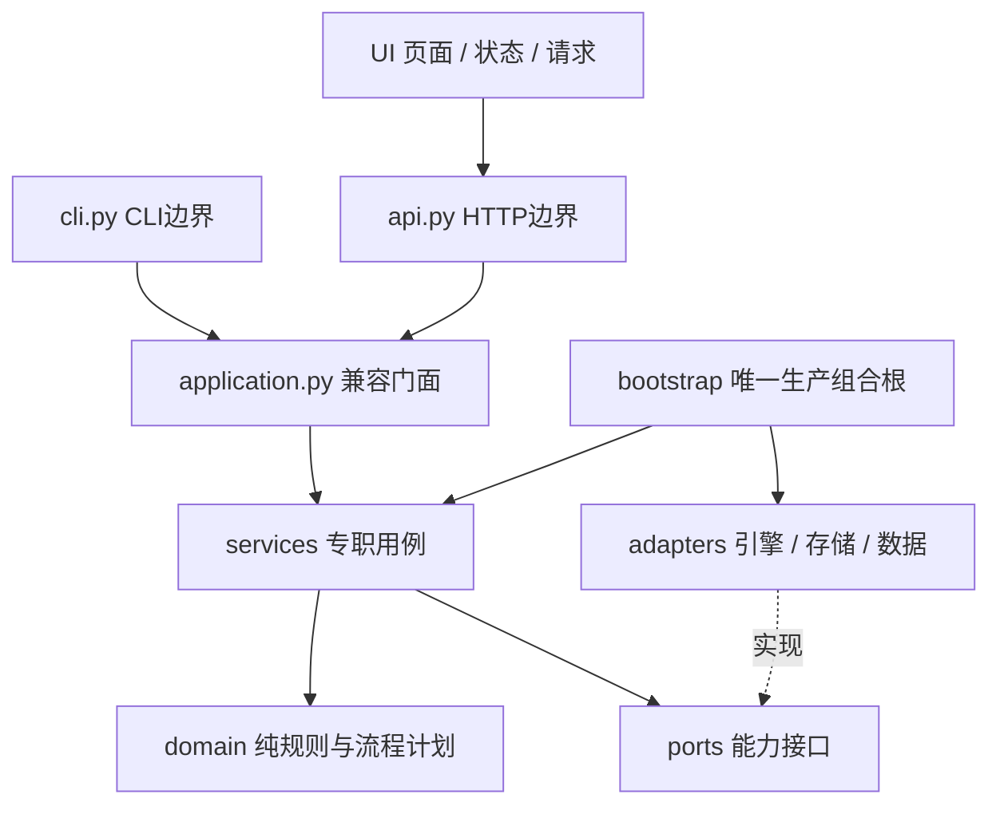
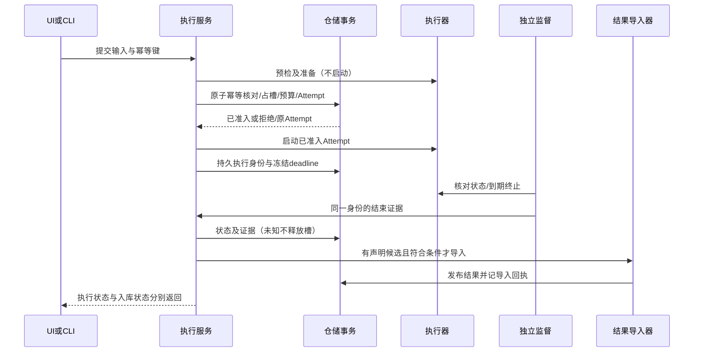

# 代码架构与实现交接合同

状态：生效架构合同，版本1，2026-09-28。来源：用户U28明确要求先落实目录、模块、接口、交互、流程、时序及角色边界，供后续实现填充。关联ARC01—12、U03/U23/U26/U27、A40。基线66d4cc77；本批实施状态与证据见IMPLEMENTATION。本文只决定结构与职责，不替代EXECUTION、VALIDATION、FACTOR_ANALYSIS、RESULT_CONTRACT的数据语义。

## 1. 架构选择与依赖

单人本地模块化单体，外部引擎独立进程。不引入微服务、消息队列、通用插件/DAG框架。框架要服务实际用例；禁止为未来能力返回虚构成功或用空实现冒充接入。

箭头为允许的调用/依赖方向；domain与ports不得反向导入service/门面/入口/适配器。服务仅依赖端口、领域规则与登记的遗留计算模块；不导入具体数据库、引擎或HTTP。组合根负责选择实现；UI不能调用存储或判断引擎内部语义。旧导入路径仅为兼容转发，新增业务禁止放入兼容模块。

## 2. 目录和职责（目标与本批范围）

| 路径 | 唯一责任 | 不应承担 |
| --- | --- | --- |
| domain/ | 纯值对象、错误、生命周期规则、固定流程计划 | 文件/数据库/网络/进程访问；读取环境配置 |
| ports/ | 仓储、执行器、数据目录、观察、运行配置等结构化协议 | 具体实现、隐藏默认配置、返回伪成功 |
| services/results.py | 导入与读取结果revision、来源投影、序列分页 | SQL、引擎产物解析 |
| services/comparison.py | 同一请求解析版本、调用比较判定、组织表格 | 前端排名、按引擎猜测口径 |
| services/factors.py | 面板登记/读取、因子分析编排 | 私自实现另一套NW/标签统计 |
| services/risk.py / validation.py | 风险与事后验证用例，调用已版本化算法 | 训练引擎执行或把事后卡当训练证据 |
| services/catalog.py | 数据目录浏览 | 通过摘要证明组件不可变 |
| services/attention.py | 按已记录状态生成待处理项 | 推断未知任务状态 |
| services/execution.py | 执行准入/核对/取消/结果入库编排 | 直接SQL、shell命令、容器SDK |
| application.py | 保留WorkbenchService入口，显式委托专职服务 | 新增算法、大段用例编排、隐式动态方法转发 |
| bootstrap.py | 从显式设置/既有环境入口构建适配器和服务 | 业务规则、导入时启动引擎 |
| adapters/storage/ | SQLite连接/schema、结果/执行/因子仓储、本地对象存储 | 在领域层传播sqlite对象或表结构 |
| adapters/executors.py | 外部进程/容器启动、终止与证据采集 | 宣布研究有效或选择策略 |
| adapters/local_data_directory.py | 已登记目录浏览 | 直接假报ARC11完整分析解析通过 |
| adapters/legacy_analysis.py | 隔离当前profile/快照路径和分析默认参数读取 | 用当前路径伪造历史身份；SR05仍须独立修复 |
| api.py / cli.py | 参数解析、传输错误映射、调用相同服务 | 复制分析公式、直接访问SQLite或组装执行器 |
| ui/state.js / transport.js | 页面选择状态与请求边界 | 量化计算、能力推断 |
| ui/app.js | 当前页面与交互编排（迁移中） | 继续扩大跨页基础设施；后续新专业页须拆为模块 |
| tests/ | 行为回归、端口契约、依赖方向检查 | 仅以存在空目录/Protocol判完成 |

遗留数值模块risk/v2、validation/v2、factors/v2、metrics等保留版本与算法，避免重构改变历史口径；其中混有文件读取的旧因子实现尚须后续分离，不能称为纯domain。research.py仍为历史快照读取/规则摘要；新研究生命周期不得继续塞入该模块。所有过渡依赖由架构门禁精确登记，允许清除，不允许静默扩大。

## 3. 模块接口与对象所有权

ports中的签名是代码接口权威，字段语义仍归专题。现有公开DTO为dict，保持兼容；新领域流程对象使用明确类型。禁止向核心传递SQLite Connection、MLflow Recorder或Qlib内部对象。

| 接口 | 调用方 / 实现方 | 语义边界 |
| --- | --- | --- |
| ResultRepository | ResultService / 本地仓储 | publish原子发布revision；查询不启动训练，结果不存在为None |
| FactorRepository | FactorService / 本地仓储 | 内容规范化后发布面板；分页/规模遵守因子合同 |
| AttemptRepository | ExecutionService / 本地仓储 | 持久执行与预算/回执；原子准入目标依EXEC13-A，不因定义Protocol即认为已实现 |
| DataDirectoryPort | CatalogService / LocalDataDirectory | available/list/summary/load/validate；浏览端口不是已校验历史分析输入端口 |
| AnalysisConfigurationPort | 风险/因子服务 / LegacyAnalysisConfiguration | 显式注入默认年化及旧快照定位；旧定位标为迁移债务 |
| ResearchObservationPort | 门面 / ResearchSnapshots | 读取离线研究记录，不执行模型或伪造实时会话 |
| ExecutorPort / AttemptImporter | ExecutionService / 引擎与导入适配器 | prepare不启动；start启动一个Attempt；poll/cancel返回证据；导入失败不反写引擎成功状态 |

端口按服务拆分；兼容WorkbenchRepository可组合三个仓储协议，但专职服务只获取所需能力。异常归domain/errors，存储与服务依赖同一异常类型；旧错误导入保持兼容。应用错误到HTTP/CLI的转换在入口完成；错误码含义不由适配器重新发明。

工厂返回完整服务对象图，不在每次请求重新创建数据库/执行器。测试可直接注入内存/临时目录实现；创建服务不得启动引擎、导入示例或下载数据。服务对象构造时不声明未实现研究能力可用。

## 4. 主流程、角色与时序

### 4.1 当前结果查询与比较

UI/CLI输入run及可选revision → 用例解析一次确切revision → ResultRepository读取 → 来源/口径规则 → 服务生成DTO → API/CLI序列化 → UI展示。比较在同一请求内复用已解析结果，不能一列一个时点读取latest；统计不可用保持原因。读取目录摘要与真正分析输入校验是不同操作。

### 4.2 执行与发布（行为目标；SR01—03未完成）

事务不能跨引擎/网络执行；启动与持久化之间的崩溃通过预分配Attempt身份/工作目录恢复，不声称两个系统原子提交。取消请求先持久化再执行，无法确认结束保留占槽。独立监督不是GET副作用的别名。真实实现及具体恢复字段依EXEC13-A单独验收，本结构批次不关闭SR。

### 4.3 后续训练/挖掘/回测固定计划

domain/workflows定义三种固定计划及步骤依赖，用于约束职责与交接，**不是运行器**。不提供单步重试/任意DAG编辑器：Attempt仍代表整份固定工作流。

- train：准备冻结输入 → 折内训练 → 预测 → 样本外评价；训练适配器产生模型和预处理状态，服务登记产物版本；验证必须实际执行，不能以现有事后卡顶替。
- mine：准备冻结输入 → 生成候选因子 → 因子评价；生成器只产出候选，统一统计服务评价，TrialLedger保留失败/淘汰/选中。
- backtest：准备冻结输入 → 读取已有信号或用已有模型预测 → 构建组合 → 模拟成交 → 评价；本路线无训练步骤，修改成本不重训。信号可用时点/成交时点依CN与数据合同。

后续研究编排服务拥有Run/Stage关联，执行服务拥有Attempt与资源政策，领域规则拥有版本/复用判定，适配器拥有引擎细节，仓储拥有事务和不可变发布。UI不决定状态晋级。未登记模型/预测输入契约、缺真实训练证据或缺数据组件就拒绝对应步骤，不填空产物继续。

T06/T07仍需冻结物理schema、研究命令DTO、产物载荷与运行适配契约；不得依据计划对象直接对外声称可训练。计划与接口不预先强制使用某个训练库或新基础设施。

## 5. 前端边界与兼容

state模块只创建/保存客户端选择与导航上下文；transport统一请求、错误与过期渲染检测；页面调用服务DTO，不本地计算指标或放宽可比性。新页面须保持研究/revision上下文及加载/空/错误/不可用状态。现有app.js的页面抽取分批进行，尚未完全拆分；不得以新增两个文件宣布T09完成。

保持既有URL、CLI命令、HTTP路由、v1默认与v2语义、WorkbenchService公开签名和旧Python导入。本批无数据库schema变化、无历史对象迁移；移动实现只变代码归属。兼容导出不复制实现；内部代码逐步使用规范路径，不新增对旧存储入口的依赖。

## 6. 交付门禁与填充规则

1. 新用例先确定要求ID、所属服务、所需端口、入参/结果/失败语义及事务边界；不能绕过专职服务在api/cli直接实现。
2. 外部依赖只进适配器，组合根注入；领域模块保持可离线测试。已有遗留例外精确列出文件/依赖和关联缺口，新例外必须先更新本合同并说明理由。
3. 自动架构检查覆盖禁止依赖、兼容转发、不允许的新顶层模块及端口方法覆盖；加入workbench_gate，不以文档约定替代检查。静态检查不证明全部运行时路径、事务原子性或类型正确。
4. 专职服务回归证明既有HTTP/CLI输出与持久化行为保持；新增依赖检查须包含故意违法输入的反例，确保检查器真的拒绝错误方向。
5. 功能交付回写IMPLEMENTATION/专题与CHANGELOG；框架验收仅为A40结构子项，不关闭A35—A42父项。SR01—06和UI能力矛盾继续开放，不能借移动文件标为修复。

## 7. 后续实现者从哪里填充

以下是指定归属，**尚未创建/实现**；不要提前建返回成功的空类。先完成IMPLEMENTATION的SR修复，再依T06/T07设计门实施。

| 待实现内容 | 指定位置 | 开始编码前必须冻结 |
| --- | --- | --- |
| 保存定义、开始研究、重试、模型复用 | services/research_runs.py；纯判定扩展domain/research.py | 命令DTO、Run/Stage/Attempt关联、幂等范围及逐类拒绝响应 |
| 研究对象/账本仓储 | ports/research.py → adapters/storage/storage_research.py | 不可变版本、事务范围、迁移/备份恢复方案；不得直接借用结果revision当定义版本 |
| 训练、预测、挖掘、回测引擎绑定 | ports中对应能力协议 → adapters中独立实现 | 输入/输出产物schema、版本身份、可用时间、失败/取消和预算证据；禁止返回引擎内部对象 |
| 专业创建页、实验详情页 | ui中独立页面模块，经app.js注册与API调用 | 与对应命令/查询DTO一致的加载、空、错误、不可用状态；URL上下文、默认值说明与恢复路径 |

固定计划的`owner`是职责标识，并非已存在服务名或可执行注册表；不得用字符串反射启动类。`prepare`由研究服务核验冻结输入；`train/predict/generate/simulate`由相应适配器提供证据；`portfolio`归策略构建；`evaluate`依流程分别归验证/因子/绩效评价。backtest的signal步骤接收已有预测或由已登记模型推理，不包含训练。各步骤产物载荷须先通过上述详细设计门；`WorkflowPlan`只保证步骤标识唯一、依赖引用先前步骤，不能证明数据正确或工作流可运行。

每个新增用例必须同时交付一份具体成功命令/响应示例、一份失败示例、端口签名、时序/事务说明和行为测试。只新增Protocol、占位按钮、schema字段或计划对象不算能力交付。测试按职责进入现有tests/test_*.py；涉及真实引擎继续使用隔离沙箱，不能借架构测试触发用户研究或访问生产库。

### 本批过渡边界的精确说明

- `tests/architecture_rules.py::LEGACY`逐文件登记旧计算/来源/研究摘要/执行政策依赖；`TOP_LEVEL`冻结旧平铺模块。旧模块内部尚未完全按新分层拆开，检查器不证明传递依赖无IO。结果算法迁移不得改变数值版本或重新解释历史数据。
- `WorkbenchSettings`显式提供存储、数据与观察根目录；`build_service`保留环境兼容入口。执行policy与旧分析profile仍使用现有加载规则，不能称为全部配置已可独立部署。`build_workbench`是生产组装入口；`WorkbenchService`直接构造且未给analysis_configuration时通过bootstrap默认工厂兼容旧调用，这是唯一有意保留的反向工厂调用。新增专职服务不得复制这种回退。
- `services/execution.py`仍保留直接构造时加载默认policy的兼容路径，生产组合根显式传入同一policy实例；其旧监督、取消、预算行为仍受SR01—03限制。
- 前端transport的`api`统一GET的JSON错误及过期渲染检测；`request`保留原始Response供提交/取消/入库处理。写操作不重放、不自动重试，也不自动套用GET的过期检测；现有写操作错误展示由页面处理。页面尚未完全模块化，后续不得误以为所有请求已统一成同一错误模型。
