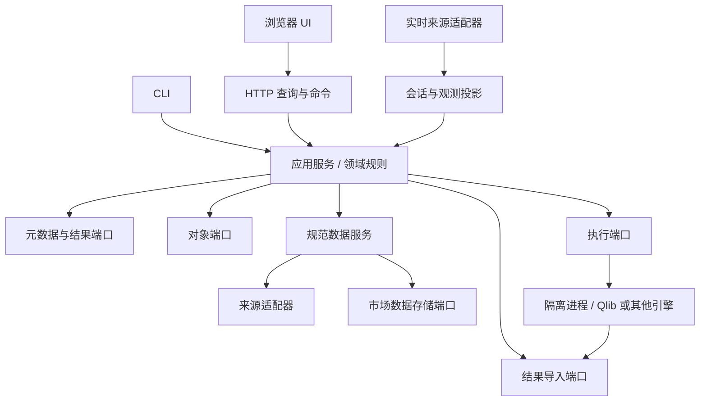

# Quant Workbench 核心规范

版本：0.1。状态：后续实现基线。适用范围：本仓库定制工作台。要求中的“必须”对应验收门槛；标记为“默认/候选”的内容可按变更流程调整。

## 0. 最高项目依据与维护要求 GOV01 / U11

本spec及已生效专题规范是项目长期演进的核心锚点，维护优先级最高。治理、冲突处理、完成门槛和长期保护约束见 [SPEC_GOVERNANCE.md](SPEC_GOVERNANCE.md)；重要变更见 [CHANGELOG.md](CHANGELOG.md)。用户最新明确决定应及时纳入规范；实现、测试或界面不得静默放宽要求。事实纠正保留证据，不以规范覆盖真实情况。

## 1. 需求来源与边界

| 类型 | 内容 |
| --- | --- |
| 用户明确要求 U01 | 保留从 Qlib 官方持续吸收更新的能力 |
| 用户明确要求 U02 | 兼容多来源、多种类数据，来源与存储解耦 |
| 用户明确要求 U03 | CLI 和可视化 UI 共用系统能力 |
| 用户明确要求 U04 | 多个训练/回测框架的结果可接入同一 UI |
| 用户明确要求 U05 | 可查看回测、训练、线上实时数据、错误率等信息，组合方式可扩展 |
| 用户明确要求 U06 | 数据库参与持久化，支持未来本地/云端替换 |
| 用户明确要求 U07 | 中国市场；佣金先按双向万二；当前可用模拟数据验证运行 |
| 用户明确要求 U08 | RD-Agent 因子研究接入同一 UI，配置 DeepSeek 聊天 API；RD-Agent fork 保留吸收官方上游更新的能力 |
| 当前工程默认 | 单人、单机、浏览器 UI、本地 API；首个引擎 Qlib；SQLite + 本地文件；实时先只读 |
| 先前研究记录，需区分实现状态 | 100 万元、中证500起步、日频、希望行业分散、最大回撤接受上限30%；均不构成已经实现的风控保证 |
| 演示参数，不能提升为产品要求 | 虚构16只股票、8只持仓、2只换出、工作日日历、历史时间切分、简化税费、收盘撮合 |
| 后续待选择 | 首个真实供应商、第二回测引擎、多用户身份、云部署目标、实时延迟目标 |

本 spec 的完整目标覆盖 U01—U11；分阶段交付不等于删除未实现需求。首阶段不包含券商下单、托管实盘、多租户、真实行情接入。策略在不同引擎间无修改运行不属于当前承诺。用户本轮要求优先完成审查和 spec，再以此实施。

## 2. 不可违反的架构约束

| ID | 必须满足的约束 |
| --- | --- |
| ARC01 | 工作台有独立包和依赖声明，不修改根 pyqlib 打包配置来收纳工作台。工作台核心不依赖 Qlib、MLflow、具体数据库 SDK 或 UI 框架 |
| ARC02 | CLI 和 HTTP 边界调用同一应用服务；业务校验、计算、能力判断和权限政策只实现一次。CLI 本地模式可直接调用服务，不强制依赖常驻 HTTP |
| ARC03 | UI 只消费版本化 DTO/API；不得读 MLflow 表、pickle 或数据库文件；UI 不根据 engine 名称分支推测业务含义 |
| ARC04 | 来源适配器、领域规范化、存储适配器、结果导入器、执行器各自独立；缺少某项能力不得默默降级或填0 |
| ARC05 | Qlib 执行采用独立进程，每次 Attempt 使用自己的配置、工作目录与输出目录；服务进程不得调用 qlib.init；外部引擎允许独立环境 |
| ARC06 | 所有研究输出必须关联来源证据；未知值显式标记，严禁用当前包版本或当前数据文件冒充历史运行版本 |
| ARC07 | 大表不能无界返回浏览器。查询必须有行数/点数上限和分页或分辨率参数，显示降采样信息 |
| ARC08 | 未实现、无样本、查询失败、陈旧数据与真实零值必须可区分，模拟数据在所有相关视图和导出中保留标记 |
| ARC09 | RD-Agent 作为外部 agent 适配；工作台核心/API 不导入其运行时对象，API/浏览器不接收密钥，执行准备遵循 [RD-Agent 接入规范](RDAGENT_INTEGRATION.md) |

采用模块化单体 + 本地执行进程。包内推荐目录：`domain/`、`application/`、`ports/`、`adapters/`、`api/`、`cli/`、`ui/`、`migrations/`、`tests/`。组合根负责选定适配器；不先建设通用插件市场或任意动态代码加载系统。

## 3. 领域模型与身份

平台 ID 是不透明稳定字符串，不把 MLflow ID 当作平台主键。外部身份由 `source_instance_id + external_id` 定位；来源实例经配置登记，URI 只是其连接属性。

| 对象 | 语义与主要字段 |
| --- | --- |
| Experiment | 用户组织研究的容器，包含名称、标签；不是一次进程 |
| Run | 一次逻辑研究工作流，可包含训练、信号、回测等多个 Stage；有创建时间、配置引用、来源、输入/输出引用 |
| Stage | `training / signal / backtest / evaluation` 等阶段；未知类型保留扩展名；外部工作流无阶段状态证据时状态为 unknown |
| Attempt | 平台实际执行一次 Run 的尝试，保存执行环境、开始/结束时间、退出码、心跳、错误；重试新建 Attempt |
| ImportReceipt | 导入任务记录：来源、外部 run、内容指纹、导入器版本、导入时间、状态、错误；不能把导入失败改写为原引擎执行失败 |
| ResultRevision | 某次导入/执行发布的不可变结果版本；详情/比较锁定 revision，重复导入不制造重复版本 |
| LiveSession | 独立持续会话：来源、订阅范围、连接状态、最后心跳、最后事件、落后量；不伪装成永不结束的 backtest |
| DatasetSnapshot | 不可变数据清单；可同时引用行情、成分、基准、日历、公司行动/PIT 等组件，具有完整性与来源状态 |
| ArtifactRef | 不透明对象 ID、类型、摘要、大小、格式/版本、可信来源；不向浏览器暴露服务器任意文件路径 |

Run 可以关联多个输入 snapshot，也可以显式标记 `provenance=partial/unknown`。历史导入可只有外部运行 ID、报告、开始时间，而没有准确代码版本；仍可浏览，但不可标记为可复现。

生命周期规则 RUN01：平台 Run 初始 queued，随后 running，终态 succeeded/failed/cancelled；执行进程失联为 interrupted，不能猜成 succeeded。导入对象可有 unknown。created_at 必填；queued 的 started_at/ended_at 为 null；终态时间若来源未记录，保留未知及来源说明。重试使用新 Attempt，保留前次失败。

取消规则 RUN02：请求取消与已取消不同；只有执行器确认进程结束后才能落终态，保存部分产物状态。取消与完成竞争时以持久化终态与退出证据为准。仅结果导入适配器没有取消执行能力。首阶段只导入，未实现的执行接口不得提供假成功响应。

幂等规则 RUN03：重复读取同一外部运行、同一内容指纹、同一导入器版本产生同一 ResultRevision；新内容或新映射版本产生新 revision，旧版可追溯。原生执行状态、平台执行状态和导入状态分别记录。

## 4. 数据接入与可复现性

DATA01：来源保存原始数据与描述；规范化生成平台语义；物化产生 Qlib bin 等引擎格式。三者都记录输入/输出版本。Qlib bin 属于可重建物化产物，不作为平台唯一数据真相。

DATA02：证券身份使用内部 instrument_id，市场代码为有有效期的别名。`XSHG:600000` 可作显示/交换别名，不能无条件假设代码永不复用。每种数据有自己的键：

| 类型 | 键/时间重点 |
| --- | --- |
| Bar | instrument、频率、区间起止、价格口径、来源修订；声明时间戳代表开盘还是收盘 |
| Quote/Trade | instrument、来源、事件时间、来源序号/事件ID；同一时间可有多条 |
| 财务/PIT | instrument、指标、报告期、公告/可用时间、修订；事件发生时间不等于可用于决策时间 |
| 成分/证券状态 | instrument、集合/状态类型、生效区间、信息可用时刻；区间采用明确的端点规则 |
| Calendar | 市场、交易日、交易时段、时区、版本；日线用 trading_date，不把本地午夜随意当 UTC |

DATA03：区分 event_time、available_at、ingested_at；未知的 available_at 不用 ingested_at 偷换成历史事实。瞬时时间传输必须带时区；日历日期和 step 不做时间戳伪装。单位声明到股/手、元/千元，价格复权及 factor 映射由适配器负责。

DATA04：snapshot 指纹基于持久化的组件内容清单和规范化版本，不在每次查询时扫描整个数据树。记录代码提交/脏补丁、依赖锁、随机种子、有效配置、日历、成分、基准、费用/成交情景及物化器版本；外部导入缺失的证据标记 unknown。当前源文件的摘要只能证明“导入时观察到”，不能证明原运行使用了它。

DATA05：规范化必须检查重复、数据类型、时间排序、OHLC/成交量约束、覆盖范围、关键字段和基准。仅当预期覆盖范围已知才计算缺失率；没有供应商历史可用时点就不能声称已排除未来信息。质量规则按数据种类配置。失败批次可留原始数据，不能静默发布为健康 snapshot。

来源能力描述至少包含数据种类、市场、频率、历史/实时、复权/PIT 支持、分页/恢复方式。缺 VWAP、历史成分或可用时点时，返回精确限制；允许用户显式选择降级情景，并持久化该选择。

## 5. 存储、发布与迁移

STORE01：按业务语义定义 Metadata/ResultRepository、MarketDataStore、ArtifactStore；不做万能 SQL Repository。首版本地元数据和小型结果序列可以同用 SQLite，重型原始/规范数据用文件；它们仍遵守独立端口。Parquet、PostgreSQL、对象存储等实现按容量和部署需求增加，不以改 URL 视为完成兼容。

STORE02：文件发布顺序是：写临时对象 → 校验并完成持久化 → 生成不可变对象清单 → 数据库事务发布 ResultRevision。查询只能读 published。事务失败产生的未引用对象可回收，不能覆盖已有版本。远端对象存储通过不可变键/清单确认完整性，不能依赖本地 rename 的原子语义。

STORE03：schema 迁移有独立版本；未知/较新数据库拒绝写入并给出诊断。升级先备份，恢复演练包括数据库和对象清单。不能因依赖降级自动删库、重建库或回退 schema。平台业务库与 MLflow 引擎原生库分开；后者只通过适配器接触。

STORE04：首版支持单写入任务、多读取；数据库事务短，训练不得持有数据库连接锁。服务重启后已发布数据仍可查询；索引支持运行排序与分页。数据库连接凭据通过配置引用注入，不进入 config_hash 的可展示内容或日志。

## 6. 引擎能力与结果标准化

ENGINE01：拆分 ResultImporter（发现/读取/映射结果）与 Executor（验证/执行/取消/获取状态）；实现其中之一即可成为支持的引擎。能力包含 operations、可输出的 artifact/series、配置 schema 版本、支持的运行模式。无法提供订单/逐笔成交时显示 unsupported 或 not_recorded，不由净值反推虚构订单。

ENGINE02：第一阶段 Qlib 适配器通过 MLflow 公共接口读取元信息，受信任的本地产物由适配器转换；核心不导入 MLflow。pickle 只能在明确可信的本地导入路径解析，不允许通过 HTTP 上传任意 pickle 自动反序列化。引擎与适配器版本分别记录，优先取运行时证据。

ENGINE03：原生产物保留，标准化结果附 source_ref、adapter_version、definition_id。通用字段之外的引擎信息放在命名空间扩展中；不能依赖扩展才能打开通用页面。第二真实引擎未定之前，以 JSON 结果适配器验证领域与界面独立性。

## 7. 指标与比较

METRIC01：MetricDefinition 与 Series/Observation 分离。定义包括名称、版本、单位、描述、公式/来源、方向、适用轴、成本/币种/价格/分红口径、年化方法与系数（适用时）。主体为 `run/stage/live_session/service/data_source/dataset` 引用，不能强制所有指标属于 Run。

METRIC02：轴为 time、trading_date、step 或 scalar。瞬时时间点有时区，日线用市场交易日及日历标识；训练点有 step 和 step_kind（epoch/iteration 等），scalar 不制造训练步或市场时间。API 返回实际轴与单位，UI 根据类型渲染。缺测 value=null 必须给 reason；JSON 中不传 NaN/Infinity。

METRIC03：观测状态为 available/empty/not_recorded/unsupported/error；freshness 独立为 fresh/stale/unknown，不能用 stale 覆盖查询失败。返回 coverage、source、observed_at、有效数据时间和降采样信息。零分母返回 null + no_samples。

METRIC04：原生指标用引擎命名空间；平台复算使用平台定义版本。Qlib 原生年化不自动改成252，不把不同口径的 native annualized_return 同名合并。首版标准图表优先展示直接可核验的权益、日收益、回撤、换手与成本。金额保留币种与精度；订单/费用金额采用 decimal 字符串或固定精度单位，图表浮点值注明只用于分析显示。

METRIC05：平台标准权益回撤为 E(t)/max(E(initial), E(s≤t))-1，最大回撤取最小值；初始权益缺失时限制首点之前的推断。总收益在无外部现金流时 E(end)/E(initial)-1；有现金流需明确使用时间加权或资金加权定义。任何基准 rebasing 都记录起点和是否完整覆盖；不把部分缺口前填为零收益。

COMPARE01：比较分三级：①并排查看总是允许，显示差异；②叠图需相同单位/轴，币种等不同需显式转换；③排名/差值需通过所选比较模式的口径检查。检查输出 comparable/partial/incompatible 及原因。可以比较不同费用情景，但应标明其为实验变量；未知数据版本不等于匹配。模拟与真实结果不得静默混入同一排名。

## 8. CLI、API 与 UI

API01：/v1 路径为未来已发布公共 API 的版本；本 spec 0.1 与未发布 schema 不声称兼容承诺。错误有 code、message、request_id、details；列表用稳定排序与游标。上限初始设100条/页、单序列2000点，可配置但必须有硬上限。

API02：首阶段提供运行列表/详情、revision、序列、能力、健康查询以及 CLI 导入。执行接口在执行阶段才启用。CLI `--json` 与 API 返回同一 DTO，时间格式、缺失语义和筛选规则相同；服务错误不得让 CLI 返回退出码0。写操作带幂等标识，长操作不在请求线程里训练。

UI01：固定领域页面承载运行详情、数据详情、对比、后续任务操作；可组合面板用于总览与观察视图。初始信息架构为总览/回测/训练/实时/数据/系统。未接入的视图明确说明能力状态；无数据时不画示意收益曲线。

| 视图 | 首批内容 | 必须保留的上下文 |
| --- | --- | --- |
| 总览 | 最近运行、当前任务、异常摘要、来源状态 | 时间窗口、最后采集时间、模拟标记 |
| 回测 | 权益/基准、回撤、成本、换手、运行对比 | 日期、币种、费用/基准口径、结果revision |
| 训练 | 训练/验证序列、IC等信号结果、配置与产物 | step类型、数据切分、模型/数据版本及未知项 |
| 实时 | 连接状态、最新有效行情、延迟/缺口 | 事件时间与接收时间、交易时段、来源 |
| 数据 | snapshot、覆盖、质量报告、来源/组件 | 规则版本、预期覆盖、修订、模拟标记 |
| 系统 | 请求/任务错误率、延迟、执行器健康 | 分母、窗口、采集覆盖、错误类别 |

UI02：面板清单包括 schema_version、revision、widget_id/type/version、类型化 query_id + 参数、筛选器绑定、布局和刷新策略；服务器校验已注册查询、参数范围、唯一ID与栅格边界。不得包含任意 SQL、表达式求值或脚本。领域计算在服务端，UI 仅显示/交互。

UI03：保存布局使用 revision 乐观并发，旧revision写入返回冲突；插件/查询缺失保留原配置并显示不可用卡片。首版先提供默认清单，拖拽编辑可后置；必须保留恢复默认能力与 schema 升级途径。筛选器和选中运行应可用 URL/保存视图恢复。

## 9. 实时与可靠性

LIVE01：历史批处理与持续流分开。流事件至少有来源、序号/事件ID、事件时间和接收时间；声明去重、迟到/乱序、断线重连、缺口/补数与保留策略。未实现恢复能力时显示 gap，不声称完整。首版可用确定性回放夹具验证，但必须显示回放模式。

LIVE02：连接是否存活与行情是否陈旧分别判断。行情新鲜度依据交易日历、当前时段与来源阈值；休市不能按普通超时自动报警。阈值未配置则 freshness=unknown。SSE 可作为后续推送实现，首版低频轮询也可；协议不决定业务准确性。

OBS01：API错误率定义为窗口内HTTP 5xx / 完成的API请求，4xx另列；静态资源与健康轮询默认排除并披露口径。任务失败率为窗口内 failed/(succeeded+failed)，cancelled单列；Attempt失败率另计。没有采集不能显示0%。统计使用窗口内计数，不能平均各子窗口百分比。

OBS02：每个命令/请求携带 request_id；执行关联 run/attempt；导入关联 receipt；日志错误分类覆盖 data/engine/platform/config。记录采集起点，重启导致的覆盖不足明确展示。健康接口区分进程存活与存储可用；不因页面正常加载就标记数据源健康。

## 10. 中国市场与配置

2026-09-26 的规则核查、代码证据和缺口优先级见 [A 股参数与差距审计](CN_A_SHARE_AUDIT.md)。该文区分已确认参数、账户假设和待实施建议，不将演示参数或审计建议自动视为已实现能力。

CN01：市场规则以版本化 ExecutionScenario 表达，至少包含佣金、最低费、其他费用、撮合价/时序、滑点、整手、交易限制和日历。配置记录 effective values；平台 UI 不再计算一套费用。

CN02：双向万二是已知佣金参数；最低5元、佣金含规费但不含过户费仍是账户假设。现行规则与来源保存在 `configs/cn/rules.current.json`，账户约定在 `account.json`。新 `ConfiguredCNExchange` 对佣金、过户费、卖出印花税、执行摩擦成本分项计算，最低费仅用于佣金。旧演示的 Qlib min_cost 合并近似保留为历史记录，不用于新入口。现行规则回放旧日期必须标为 current_rules_counterfactual；未实现历史规则自动选择。

CN03：信号可用时点必须早于执行决策，训练/验证边界按标签所需未来区间留出间隔。成交可行性受数据粒度限制；日线近似不能宣称模拟了真实排队。行业分散、持仓限制和30%回撤容忍均独立记录；未实现强制约束时不得声称有风险保证。

CN04：`configs/cn/profile.json` 是共享配置入口，引用独立规则/账户/日历/研究文件。编译器生成 Qlib 和 RD-Agent 模板，生成 YAML 不手改；每次运行保存有效参数和配置指纹。日历越界、未知配置、未支持的真实数据/状态/频率不得静默降级。默认只执行合成行情、正常状态、日频现金股票；IPO、退市整理、公司行动现金税、行业约束、实盘均保留能力缺口。

CN05：过程成功、产物完整和研究质量分开。CNQualityRecord 记录有效IC天数、常数预测天数、交易天数、门槛与失败原因；passed_checks不代表alpha有效。UI和导入器读取运行时JSON证据，不用当前配置伪装历史运行。配置变化不能复用未包含情景指纹的上游结果缓存。

## 11. 安全、升级与工程交付

OPS01：首版只绑定 loopback。未具备身份验证/授权时拒绝对外开放；浏览器写操作校验来源，配置/凭据脱敏。导入路径由可信本地配置决定，浏览器不能任意指定服务器文件或可执行命令。这是当前本机边界要求，不等待生产化阶段再补。

OPS02：锁定工作台依赖及测试过的 Qlib revision/环境；两个包可独立升级。同步上游在集成分支审阅变更并执行验收；不自动快进用户的工作分支，不自动迁移历史 MLflow 库。保留本地修改/数据与迁移前备份。

OPS03：契约与实现建立测试映射；检查核心层导入方向。不得把“fixture可用”“真实适配器可用”“线上可用”混称为完成。每次交付列明已实现、未实现、运行命令和验收证据。

## 12. 变更约束

用户后续明确要求可以调整本 spec；实现者发现矛盾先更新决策记录，不能仅在代码里改掉要求。任何领域语义变更必须说明：变更原因、影响的ID、数据/API兼容性、迁移办法和验收变化。未发布契约允许调整；发布后破坏性变化需要新版本或迁移。技术选型细节不得自动扩展产品范围。

## 13. 研究工作台闭环 U09

新增用户要求与验收见 [RESEARCH_WORKBENCH.md](RESEARCH_WORKBENCH.md)。RD-Agent 历史产物通过离线可信导出适配器转换为中立 JSON 观察记录和平台结果；结果复用通用详情与比较，过程使用研究详情。API 进程遥测记录真实请求、5xx/4xx、窗口/重启覆盖；不能代替任务 Attempt 监控。判断摘要由共享应用服务产生，明确事实、质量缺口与后续验证动作。

## 14. 来源与能力标记 U10

详见 [PROVENANCE_AUDIT.md](PROVENANCE_AUDIT.md)。行情性质与字段来源分别标记；手写fixture不得伪装引擎产物或参与研究排名。查询返回来源/公式/限制，默认未知，不凭指标前缀声称原生。质量检查、规则建议、服务遥测明确为工作台新增；Agent意见明确为生成内容。能力受限与未接入使用可见文字标记，不只依赖颜色。历史结果不可变，分类作为读取投影附加。
