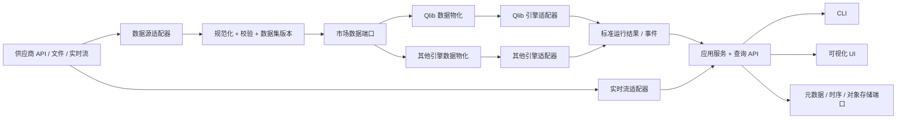

> 已归档、非当前规范。以 `docs/spec/` 为准；本文状态及接口描述仅表示审查前的设计。

# Qlib 工作台架构草案（v1）

状态：已确定分层和首版契约；界面技术、云数据库与第二回测引擎尚未选型。本文是开发边界，不声称完整系统已经实现。

## 目标和约束

1. 持续吸收 `microsoft/qlib` 上游更新。现有 `qlib/` 保持上游代码；定制代码优先放在 `extensions/workbench/`，通过公开接口和适配器接入。
2. CLI 与可视化 UI 调用同一应用服务及查询 API，不能分别实现数据解释、成本计算和运行状态逻辑。
3. 数据源、数据存储、训练/回测引擎、实验记录存储和 UI 各自可替换；允许同一屏比较不同引擎，但必须保留指标口径及能力差异。
4. 首版仍聚焦中国 A 股日频、研究和回测。实时行情展示先设计为只读；交易执行、账户联动和自动下单另设边界。

## 模块边界

| 模块 | 职责 | 首版实现方向 |
| --- | --- | --- |
| `source` | 拉取/接收原始数据，声明能力、字段、更新频率和授权范围 | 本地 CSV/Parquet；供应商 API 后加 |
| `normalize` | 统一证券标识、时区、交易日、价格/数量单位、复权、缺失语义 | A 股日线与指数；保留原始副本 |
| `catalog` | 数据集版本、来源、校验报告、可用时间、血缘 | SQLite 元数据 + 本地 Parquet |
| `materializer` | 从规范数据生成各引擎所需格式 | 先 Qlib bin；按需增加其他引擎 |
| `engine` | 启动训练/回测并转换产物；声明支持的能力 | 先接 Qlib `qrun`/MLflow 结果 |
| `results` | 保存统一的运行、指标序列、订单、成交、持仓、事件与产物引用 | 契约在 `extensions/workbench/contracts/` |
| `application` | 创建任务、查询、比较、权限和调度；CLI/UI 共用 | 先单机本地服务，后扩展队列 |
| `api` | 版本化 HTTP 查询、任务命令、实时订阅 | 首版 REST；实时用 SSE，确有双向需求再用 WebSocket |
| `ui` | 从面板清单渲染卡片、图表、表格和筛选器 | UI 只依赖 API 契约，不导入 Qlib |

数据源适配器与数据库适配器是两种不同边界：前者解释外部数据；后者持久化平台自己的规范数据和结果。Qlib 自身的 `CalendarProvider`、`InstrumentProvider`、`FeatureProvider`、`BaseHandlerStorage` 可供 Qlib 物化端使用，但不作为整个工作台的公共数据契约。实验记录读取使用 Qlib/MLflow 的公开接口或产物，避免 UI 直接查询 Qlib 私有表和 pickle。

## 数据层契约

规范记录以 `instrument_id + event_time + source_id + dataset_version` 为定位键。`instrument_id` 使用带市场的稳定格式，例如 `XSHG:600000`；适配器负责映射 Qlib 的 `SH600000` 等代码。时间一律保留原始时区及 UTC 时间戳，日线还保留中国交易日。字段按数据种类分表或分文件：日线、分钟线、指数、成分历史、公司行动、财务/PIT、实时行情、订单/成交。不要用一张万能行情表表达不同可用时点和复权口径。

每个数据集版本记录来源、原始文件校验和、供应商版本、采集时刻、字段映射版本、清洗规则版本、交易日历版本、复权方式、数据许可和质量报告。质量门槛至少覆盖：主键重复、时间倒序、价格/成交量异常、日历缺口、跨市场代码冲突、基准缺失及未来信息。失败批次保留原始数据但不能提升为“可用于研究”。

查询端口按用途拆分为 `BarReader`、`UniverseReader`、`PointInTimeReader`、`LiveQuoteSubscriber`；写入端口为 `IngestWriter`。适配器声明 `asset_types / frequencies / adjustment / point_in_time / live / backfill` 能力。缺少能力时返回明确错误，不能静默把 VWAP 改为收盘价，也不能用当前指数成员回填历史。

## 数据库与文件存储

“数据库可替换”落在端口层，而非在业务代码中到处传一个数据库 URL：

| 数据 | 本地首版 | 可替换实现 | 边界 |
| --- | --- | --- | --- |
| 任务、数据目录、面板、用户配置 | SQLite | PostgreSQL/云托管 PostgreSQL | `MetadataRepository` |
| 历史大表与指标序列 | 分区 Parquet，查询可用 DuckDB | 对象存储 + ClickHouse/其他分析库 | `SeriesStore` |
| 模型、报告、原始文件 | 本地文件系统 | S3 兼容对象存储 | `ArtifactStore` |
| 实时缓冲与事件 | 首版进程内/数据库持久化 | Redis Streams/Kafka 等 | `EventBus` |

Qlib 使用的 MLflow 实验库继续作为引擎原生产物，工作台只同步必要元数据与标准结果；不将 MLflow 数据库当成业务数据库。存储适配器需支持健康检查、迁移版本、分页、幂等写入和备份恢复。数据库连接信息走环境变量或密钥管理，不放到仓库配置。

## 引擎层与指标比较

引擎适配器统一暴露 `capabilities()`、`validate(config, dataset)`、`submit()`、`status()`、`cancel()`、`collect()`。运行可为 `training`、`backtest`、`live_monitor`；运行 ID、引擎版本、配置哈希、数据集版本和状态是必填血缘。首版只实现 Qlib；第二引擎选定后用同一份小数据和同一费用口径做契约验收。

标准结果包括：权益曲线、基准曲线、订单、成交、逐日持仓、费用分项、训练指标、模型产物、日志和异常。每项指标必须记录单位、年化方法、收益/分红口径、成本口径、频率、币种和计算实现版本。缺失项标记 `unsupported` 或 `not_recorded`，不可填 0。跨引擎对比默认展示相同时间区间、相同基准、相同成本口径；口径不一致时 UI 显示差异，禁止直接排序。

## CLI、API 与 UI

CLI 命令和 UI 操作都进入 `application` 服务。建议首版 API：`GET /v1/datasets`、`GET /v1/runs`、`POST /v1/runs`、`GET /v1/runs/{id}`、`GET /v1/runs/{id}/series`、`GET /v1/events`、`GET/PUT /v1/dashboards/{id}`、`GET /v1/health`。长任务返回运行 ID，由后台 worker 执行；读取接口不启动模型。CLI 只做这些服务的另一种呈现，不绕过权限和校验。

面板布局使用版本化 JSON 清单：页面、卡片、查询键、筛选器、栅格位置、刷新间隔。首版推荐六页，用户以后能保存个人布局：

| 页面 | 首屏信息 | 可下钻内容 |
| --- | --- | --- |
| 总览 | 数据新鲜度、运行成功率、最近任务、当前异常 | 指向各详情页 |
| 回测 | 净值/基准、成本后超额、回撤、换手、费用 | 持仓、成交、行业暴露、引擎对比 |
| 训练 | 任务状态、训练/验证曲线、IC/RankIC、模型版本 | 特征重要性、参数、数据切分、日志 |
| 实时 | 最新行情时间、延迟、订阅状态、组合估值 | 证券明细、流中断与补数记录 |
| 数据质量 | 覆盖率、缺失率、异常数量、版本 | 来源、字段映射、失败批次 |
| 系统 | 任务失败率、API 错误率、延迟、队列积压 | 错误分类、trace/run ID、重试记录 |

“错误率”必须明确分母和窗口：例如 `5 分钟内失败 API 请求数 / 总 API 请求数`、`24 小时失败任务数 / 已结束任务数`，并区分数据源错误、运行引擎错误和平台错误。无请求时显示“无样本”，不是 0%。每张卡显示最后更新时间及数据来源；实时失联显示陈旧状态，不能继续冒充实时。

## 中国市场默认口径

延用当前研究约定：日频、中证500起步、100 万元、佣金买卖万二。费用与交易规则单独版本化，不能硬编码在 UI；印花税、过户费、最低佣金、涨跌停、ST、停牌、T+1、整手、复权/原始成交价都应由数据和执行规则共同决定。现有演示配置是简化回测，不能作为正式税费或成交规则实现。实时数据首次只展示行情与系统状态，不推导“可成交”结论。

## 实施顺序与验收

1. **基础版**：冻结 v1 契约；实现 Qlib 运行结果导入、SQLite 元数据、本地 Parquet/文件产物、CLI 查询和只读 API。使用现有模拟数据跑通：`qrun → 标准结果 → CLI/API 同值`。
2. **第一版 UI**：按面板清单渲染总览、回测、训练、数据质量、系统页；保存布局；用模拟事件验证实时页和陈旧提示。
3. **数据接入**：接入一个真实供应商，建立原始区/规范区/物化区与质量闸门；补历史成分、费用和公司行动。
4. **多引擎**：接第二回测框架，跑契约测试、比较口径检查和相同样本对照；不为迁就某引擎修改公共模型。
5. **生产化**：任务队列、权限、审计、密钥管理、迁移/备份、告警和部署。云数据库与对象存储只通过已有端口替换。

每阶段保留端到端验收数据与版本。首版不先引入微服务、消息队列或大型时序数据库；这些由实际容量和实时性指标触发。

## 上游同步约定

本机 `origin` 指向 `CheungVane/qlib`，`upstream` 指向 `microsoft/qlib`。本轮已在 `codex/platform-foundation` 分支快进到 `upstream/main` 的 `be725493`；之前的本地演示文件和研究文档已保留。后续保持 `main` 跟随官方；定制工作在 `codex/*` 或项目功能分支，并尽量不改 `qlib/` 核心。每次同步执行：获取上游 → 审阅依赖/接口变化 → 在集成分支合并或变基 → 跑演示工作流及适配器契约测试 → 再合入定制分支。若必须修 Qlib 核心，先写适配层可行性和升级影响，再考虑向上游提 PR。

配置、数据字典和指标口径也要版本化。正式实施前需确定：第一个真实数据源与授权边界、第二回测引擎、单人还是多用户、实时延迟目标和部署地点；这些不阻碍基础版契约与单机实现。
